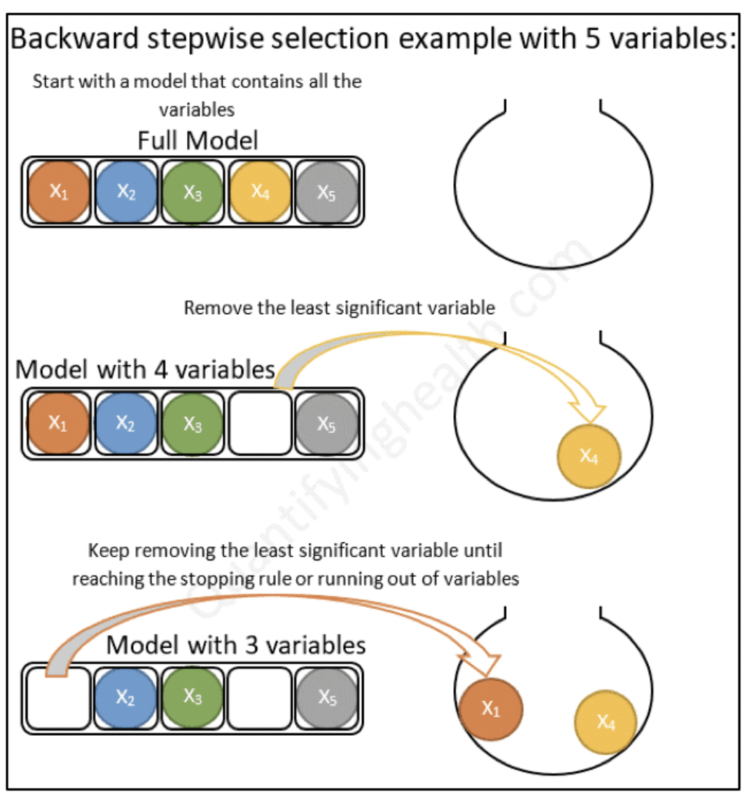

::: watermark

:::

# Regresión Lineal

En esta sección aprenderemos sobre _**regresión lineal simple y múltiple**_, como se ajusta un modelo de regresión en *python*, las métricas de desempeño para problemas de regresión y como podemos comparar modelos con estas métricas. Existen dos tipos de modelos de regresión lineal: 

## Regresión lineal simple

En la regresión lineal simple se utiliza **una variable independiente o explicativa "X"** (numérica o categórica) para estimar una variable dependiente o de respuesta numérica _**"Y"**_ mediante el ajuste de una recta permita conocer la relación existente entre ambas variables. Dicha relación entre variables se expresa como:

$$Y = \beta_0 + \beta_1X_1 + \epsilon \approx b + mx$$
**Donde:**

> $\epsilon \sim Norm(0,\sigma^2)$ (error aleatorio)
>
> $\beta_0$ = Coeficiente de regresión 0 (Ordenada al origen o intercepto)
>
> $\beta_1$ = Coeficiente de regresión 1 (Pendiente o regresor de variable $X_1$)
>
> $X_1$ = Variable explicativa observada
>
> $Y$ = Respuesta numérica

Debido a que los valores reales de $\beta_0$ y $\beta_1$ son desconocidos, procedemos a estimarlos estadísticamente:

$$\hat{Y} = \hat{\beta}_0 + \hat{\beta}_1X_1$$
Con $\hat{\beta}_0$ el estimado de la ordenada al origen y $\hat{\beta}_1$ el estimado de la pendiente.

```{r, echo=FALSE, warning=FALSE, message=F}
library(plotly)
library(readr)

didi <- read_csv("data/hrs_vs_ganancias_didi.csv")

fit <- lm(Ganancias ~ Horas, data = didi)

didi %>% 
  plot_ly(x = ~ Horas) %>% 
  add_markers(y = ~ Ganancias) %>% 
  add_lines(x = ~ Horas, y = fitted(fit))
```


### Interpretación

Una de las bondades de los modelos lineales es la interpretabilidad de los elementos que lo componen. Los coeficientes de regresión.

Los coeficientes de regresión representan el **cambio medio en la variable de respuesta para una unidad de cambio en la variable predictora.** Este control estadístico que ofrece la regresión es importante, porque aísla el rol de una variable del resto de las variables incluidas en el modelo.

La clave para entender los coeficientes es pensar en ellos como pendientes, y con frecuencia se les llama coeficientes de pendiente. Ilustremos lo anterior con el siguiente ejemplo de Didi:

\begin{align}
\hat{Y} &= \hat{\beta}_0 \quad + \hat{\beta}_1X_1 \\

& = 108.6 + 156X_1
\end{align}

$\hat{\beta}_0$ = Es el valor esperado en la variable de respuesta cuando $\beta_1$ es cero.

$\hat{\beta}_1$ = Es el cambio esperado en la variable de respuesta por cada unidad de cambio en $X_1$.


::: {.infobox .important data-latex="{important}"}
**¡¡ IMPORTANTE !!**

Al analizar la interpretación de los coeficientes de regresión es importante tomar en cuenta que esta interpretación se realiza sobre la estructura predictiva de un modelo y no sobre el fenómeno en sí mismo.
:::


## Regresión lineal múltiple 

Cuando se utiliza **más de una** variable independiente, el proceso se denomina regresión lineal múltiple. En este escenario no es una recta sino un hiper-plano lo que se ajusta a partir de las covariables explicativas $\{X_1, X_2, X_3, ...,X_n\}$

El objetivo de un modelo de regresión múltiple es tratar de explicar la relación que existe entre una
variable dependiente (variable respuesta) $"Y"$ un conjunto de variables independientes (variables
explicativas) $\{X1,..., Xm\}$, el modelo es de la forma:

$$Y = \beta_0 + \beta_1X_1 + \cdot \cdot \cdot + \beta_mX_m + \epsilon$$

* **Donde:**

- $Y$ como variable respuesta.

- $X_1,X_2,...,X_m$ como las variables explicativas, independientes o regresoras.

- $\beta_1, \beta_2,...,\beta_m$ Se conocen como coeficientes parciales de regresión. Cada una de ellas puede interpretarse como el efecto promedio que tiene el incremento de una unidad de la variable predictora $X_i$ sobre la variable dependiente $Y$, manteniéndose constantes el resto de variables.


```{r, warning=FALSE,message=FALSE, echo=FALSE}
library(reshape2)

my_df <- iris %>% rename(
  Daily_hrs = Sepal.Length,
  Income = Petal.Length,
  Travels_by_hr = Sepal.Width,
  Turn = Species) %>% 
  select(-Petal.Width) %>% 
  mutate(Turn = factor(case_when(
    Turn == "setosa" ~ "afternoon",
    Turn == "versicolor" ~ "morning",
    T ~ "night")),
    Income = Income * 150
  )

didi_lm <- lm(Income ~  Daily_hrs + Travels_by_hr, data = my_df)
graph_reso <- 0.05

#Setup Axis
axis_x <- seq(min(my_df$Daily_hrs), max(my_df$Daily_hrs), by = graph_reso)
axis_y <- seq(min(my_df$Travels_by_hr), max(my_df$Travels_by_hr), by = graph_reso)

#Sample points
didi_lm_surface <- expand.grid(Daily_hrs = axis_x, Travels_by_hr = axis_y, KEEP.OUT.ATTRS = F)
didi_lm_surface$Income <- predict.lm(didi_lm, newdata = didi_lm_surface)
didi_lm_surface <- acast(didi_lm_surface, Travels_by_hr ~ Daily_hrs, value.var = "Income") #y ~ x

hcolors = c("red", "blue", "green")[my_df$Turn]
didi_plot <- plot_ly(my_df, 
                     x = ~Daily_hrs, 
                     y = ~Travels_by_hr, 
                     z = ~Income,
                     text = ~Turn, # EDIT: ~ added
                     type = "scatter3d", 
                     mode = "markers",
                     size = 1,
                     marker = list(color = hcolors))
didi_plot <- add_trace(p = didi_plot,
                       z = didi_lm_surface,
                       x = axis_x,
                       y = axis_y,
                       type = "surface")

didi_plot
```

### Interpretación

De la misma manera en que se interpretan los coeficientes de regresión en el caso simple, también se interpretan los coeficientes en el caso múltiple.

En el ejemplo anterior, se tienen 3 variables explicativas, las cuales son:

* **Horas diarias**: Se refiere al número de horas trabajadas por día.

Interpretación: Por cada hora adicional de trabajo al día, en promedio aumenta $\$97$ el ingreso, manteniendo el resto de variables constantes.

* **Viajes por hr**: Es el número de viajes terminados por hora (en promedio).

Interpretación: Por cada viaje adicional en una hora, en promedio se reduce el ingreso en $\$6.08$, manteniendo el resto de variables constantes.

* **Turno**: Es el turno en que se trabaja (mañana, tarde, noche).  Al ser una variable categórica, cada categoría produce un efecto distinto sobre la variable de respuesta.

  * Mañana (4:00am - 12:00pm): Cuando se trabaja en la mañana, se obtiene en promedio $\$325.5$ más ingresos, **en comparación con trabajar en la tarde**.

  * Noche (8:00pm - 4:00am): Cuando se trabaja en la noche, se obtiene en promedio $\$457.4$ más ingresos, **en comparación con trabajar en la tarde**.

* **Intercepto**: Es el ingreso promedio cuando todas las variables son cero, en promedio y se trabaja en la tarde $-\$245.145$.


## Ajuste de modelo

### Estimación de parámetros: Regresión lineal simple

En la gran mayoría de casos, los valores $\beta_0$ y $\beta_1$ poblacionales son desconocidos, por lo que, a partir de una muestra, se obtienen sus estimaciones $\hat{\beta_0}$ y $\hat{\beta_1}$. Estas estimaciones se conocen como coeficientes de regresión o *least square coefficient estimates*, ya que toman aquellos valores que minimizan la suma de cuadrados residuales, dando lugar a la recta que pasa más cerca de todos los puntos.

```{r, fig.align='center', out.height='250pt', out.width='500pt', echo=F, include=TRUE}
knitr::include_graphics("img/05-ml-lineal/501_ajuste_lineal.svg")
```

En términos analíticos, la expresión matemática a optimizar y solución están dadas por:

$$min(\epsilon) \Rightarrow min(y-\hat{y}) = min\{y -(\hat{\beta}_0 + \hat{\beta}_1x)\}$$

\begin{aligned}

\hat{\beta}_0 &= \overline{y} - \hat{\beta}_1\overline{x} \\

\hat{\beta}_1 &= \frac{\sum^n_{i=1}(x_i - \overline{x})(y_i - \overline{y})}{\sum^n_{i=1}(x_i - \overline{x})^2} =\frac{S_{xy}}{S^2_x}

\end{aligned}


**Donde:**

> - $S_{xy}$ es la covarianza entre $x$ y $y$. 
>
> - $S_{x}^{2}$ es la varianza de $x$. 
>
> - $\hat{\beta}_0$ es el valor esperado la variable $Y$ cuando $X = 0$, es decir, la intersección de la recta con el eje y.


### Estimación de parámetros: Regresión lineal múltiple

En el caso de múltiples parámetros, la notación se vuelve más sencilla al expresar el modelo mediante una combinación lineal dada por la multiplicación de matrices (álgebra lineal).

$$Y = X\beta + \epsilon$$

**Donde:** 

$$Y = \begin{pmatrix}y_1\\y_2\\.\\.\\.\\y_n\end{pmatrix} \quad \beta = \begin{pmatrix}\beta_0\\\beta_1\\.\\.\\.\\\beta_m\end{pmatrix} \quad \epsilon = \begin{pmatrix}\epsilon_1\\\epsilon_2\\.\\.\\.\\\epsilon_n\end{pmatrix} \quad \quad X = \begin{pmatrix}1 & x_{11} & x_{12} & ... & x_{1m}\\1 & x_{21} & x_{22} & ... & x_{2m}\\\vdots & \vdots & \vdots & \ddots & \vdots\\ 1 & x_{n1} & x_{n2} & ... & x_{nm}\end{pmatrix}\\$$

El estimador por mínimos cuadrados está dado por:

$$\hat{\beta} = (X^TX)^{-1}X^TY$$

## Residuos del modelo

El residuo de una estimación se define como la diferencia entre el valor observado y el valor esperado acorde al modelo. 

$$\epsilon_i= y_i -\hat{y}_i$$

A la hora de contemplar el conjunto de residuos hay dos posibilidades:

- La suma del valor absoluto de cada residuo.

$$RAS=\sum_{i=1}^{n}{|e_i|}=\sum_{i=1}^{n}{|y_i-\hat{y}_i|}$$

- La suma del cuadrado de cada residuo (RSS). Esta es la aproximación más empleada (mínimos cuadrados) ya que magnifica las desviaciones más extremas.

$$RSS=\sum_{i=1}^{n}{e_i^2}=\sum_{i=1}^{n}{(y_i-\hat{y}_i)^2}$$

Los residuos son muy importantes puesto que en ellos se basan las diferentes métricas de desempeño del modelo.

```{r, echo=FALSE}
library(ggplot2)
library(ggimage)

set.seed(123)
iris2 <- iris[sample(1:nrow(iris), 30),]
model <- lm(Petal.Length ~ Sepal.Length, data=iris2)
iris2$fitted <- predict(model)

ggplot(iris2, aes(x = Sepal.Length, y = Petal.Length)) +
  geom_linerange(aes(ymin = fitted, ymax = Petal.Length),
                 colour = "purple") +
  geom_abline(intercept = model$coefficients[1],
              slope = model$coefficients[2]) +
    geom_emoji(aes(image = ifelse(abs(Petal.Length-fitted) > 0.5, '1f622', '1f600')))
```


### Condiciones para el ajuste de una regresión lineal: {-}


Existen ciertas condiciones o supuestos que deben ser validados para el correcto ajuste de un modelo de regresión lineal, los cuales se enlistan a continuación: 

- **Linealidad**: La relación entre ambas variables debe ser lineal.

- **Distribución normal de los residuos**: Los residuos se tiene que distribuir de forma normal, con media igual a 0.

- **Varianza de residuos constante (homocedasticidad)**: La varianza de los residuos tiene que ser aproximadamente constante.

- **Independencia**: Las observaciones deben ser independientes unas de otras.

Dado que las condiciones se verifican a partir de los residuos, primero se suele generar el modelo y después se valida. 


## Implementación con Python

Se realizará el ajuste del modelo utilizando los conceptos estudiados anteriormente. Se llevará a cabo la implementación simple y también usando el esquema de partición de muestra mediante KFCV.

### Carga y partición de datos

```{python}
from sklearn.compose import ColumnTransformer
from sklearn.preprocessing import StandardScaler, OneHotEncoder
from sklearn.linear_model import LinearRegression
from sklearn.pipeline import Pipeline

from plydata.one_table_verbs import pull
from sklearn.model_selection import train_test_split
from mizani.formatters import comma_format, dollar_format
from plotnine import *
from siuba import *

import pandas as pd

ames = pd.read_csv("data/ames.csv")

ames_y = ames >> pull("Sale_Price")    # ames[["Sale_Price"]]
ames_x = select(ames, -_.Sale_Price)   # ames.drop('Sale_Price', axis=1)

ames_x_train, ames_x_test, ames_y_train, ames_y_test = train_test_split(
 ames_x, ames_y, 
 test_size = 0.20, 
 random_state = 195
 )
```


### Pipeline de transformación de datos

```{python}
# pip install mlxtend==0.23.0
from mlxtend.feature_selection import ColumnSelector

# Seleccionamos las variales numéricas de interés
num_cols = ["Full_Bath", "Half_Bath"]

# Seleccionamos las variables categóricas de interés
cat_cols = ["Overall_Cond"]

# Juntamos todas las variables de interés
columnas_seleccionadas = num_cols + cat_cols

pipe = ColumnSelector(columnas_seleccionadas)
ames_x_train_selected = pipe.fit_transform(ames_x_train)

ames_train_selected = pd.DataFrame(
  ames_x_train_selected, 
  columns = columnas_seleccionadas
  )

ames_train_selected.info()

# ColumnTransformer para aplicar transformaciones
preprocessor = ColumnTransformer(
    transformers = [
        ('scaler', StandardScaler(), num_cols),
        ('onehotencoding', OneHotEncoder(drop='first'), cat_cols)
    ],
    verbose_feature_names_out = False,
    remainder = 'passthrough'  # Mantener las columnas restantes sin cambios
)

transformed_data = preprocessor.fit_transform(ames_train_selected)
new_column_names = preprocessor.get_feature_names_out()

transformed_df = pd.DataFrame(
  transformed_data.todense(), 
  columns=new_column_names
  )
  
transformed_df

transformed_df.info()

```


### Creación y ajuste de modelo 

```{python}
# Crear el pipeline con la regresión lineal
pipeline = Pipeline([
   ('preprocessor', preprocessor),
   ('regressor', LinearRegression())
])

# Entrenar el pipeline
results = pipeline.fit(ames_train_selected, ames_y_train)
```

### Predicción con nuevos datos

```{python}

y_pred = pipeline.predict(ames_x_test)

ames_test = (
  ames_x_test >>
  mutate(Sale_Price_Pred = y_pred, Sale_Price = ames_y_test)
)

ames_test.info()

(
ames_test >>
  select(_.Sale_Price, _.Sale_Price_Pred)
)

```


### Extracción de coeficientes

```{python}
import statsmodels.api as sm

X_train_with_intercept = sm.add_constant(transformed_df)
model = sm.OLS(ames_y_train, X_train_with_intercept).fit()

model.summary()

```

---

**IMPORTANTE:** Es necesario entender que para cada uno de los coeficientes de regresión se realiza una prueba de hipótesis. Una vez calculado el valor estimado, se procede a determinar si este valor es significativamente distinto de cero, por lo que la hipótesis de cada coeficiente se plantea de la siguiente manera:

$$H_0:\beta_i=0 \quad Vs \quad H_1:\beta_i\neq0$$
El software *R* nos devuelve el p-value asociado a cada coeficiente de regresión. Recordemos que valores pequeños de *p* sugieren que al rechazar $H_0$, la probabilidad de equivocarnos es baja, por lo que procedemos a rechazar la hipótesis nula.


## Métricas de desempeño

Dado que nuestra variable a predecir es numérica, podemos medir qué tan cerca o lejos estuvimos del número esperado dada una predicción.

Las métricas de desempeño asociadas a los problemas de regresión ocupan esa distancia cómo cuantificación del desempeño o de los errores cometidos por el modelo.

Las métricas más utilizadas son:

* MEA: Mean Absolute Error
* MAPE: Mean Absolute Percentual Error $\quad \Rightarrow \quad$ más usada para reportar resultados
* RMSE: Root Mean Squared Error $\quad \quad \quad \Rightarrow \quad$ más usada para entrenar modelos
* $R^2$ : R cuadrada
* $R^2$ : $R^2$ ajustada $\quad \quad \quad \quad \quad \quad \Rightarrow \quad$ usada para conocer potencial de mejora

---

**MAE**: *Mean Absolute Error*

$$MAE = \frac{1}{N}\sum_{i=1}^{N}{|y_{i}-\hat{y}_{i}|}$$
**Donde:**

- $N:$ Número de observaciones predichas.
- $y_{i}:$ Valor real.
- $\hat{y}_{i}:$ Valor de la predicción.

<br>


Esta métrica suma los errores absolutos de cada predicción y los divide entre el número de observaciones, para obtener el promedio absoluto del error del modelo.

**Ventajas Vs Desventajas:**

**Todos los errores pesan lo mismo sin importar qué tan pequeños o qué tan grandes sean**, es muy sensible a valores atípicos, y dado que obtiene el promedio puede ser que un solo error en la predicción que sea muy grande afecte al valor de todo el modelo, aún y cuando el modelo no tuvo errores tan malos para el resto de las observaciones.

Se recomienda utilizar esta métrica cuando los errores importan lo mismo, es decir, importa lo mismo si se equivocó muy poco o se equivocó mucho.

---

**MAPE**: *Mean Absolute Percentage Error*

$$MAPE = \frac{1}{N}\sum_{i=1}^{N}\frac{{|y_{i}-\hat{y}_{i}|}}{|y_{i}|}$$
**Donde:**

$N:$ Número de observaciones predichas.

$y_{i}:$ Valor real.

$\hat{y}_{i}:$ Valor de la predicción.

<br>


Esta métrica es la métrica MAE expresada en porcentaje, por lo que mide el error del modelo en términos de porcentaje, al igual que con MAE, no hay errores negativos por el valor absoluto, y mientras más pequeño el error es mejor.

**Ventajas Vs Desventajas:**

Cuando existe un valor real de 0 esta métrica no se puede calcular, por otro lado, una de las ventajas sobre MAE es que no es sensible a valores atípicos.

Se recomienda utilizar esta métrica cuando en tu problema no haya valores a predecir que puedan ser 0, por ejemplo, en ventas puedes llegar a tener 0 ventas, en este caso no podemos ocupar esta métrica.

En general a las personas de negocio les gusta esta métrica pues es fácil de comprender.

---

**RMSE**: *Root Mean Squared Error*

$$RMSE = \sqrt{\frac{1}{N}\sum_{i=1}^{N}{(y_{i}-\hat{y}_{i})^2}}$$
**Donde:**

- $N:$ Número de observaciones predichas.
- $y_{i}:$ Valor real.
- $\hat{y}_{i}:$ Valor de la predicción.

<br>

Esta métrica es muy parecida a MAE, solo que en lugar de sacar el valor absoluto de la diferencia entre el valor real y el valor predicho, para evitar valores negativos eleva esta diferencia al cuadrado, y saca el promedio de esa diferencia, al final, para dejar el valor en la escala inicial saca la raíz cuadrada.

Esta es la métrica más utilizada en problemas de regresión, debido a que es más fácil de optimizar que el MAE.

**Ventajas Vs Desventaja:**

Todos los errores pesan lo mismo sin importar qué tan pequeños o qué tan grandes sean, es más sensible a valores atípicos que MAE pues eleva al cuadrado diferencias, y dado que obtiene el promedio puede ser que un solo error en la predicción que sea muy grande afecte al valor de todo el modelo, aún y cuando el modelo no tuvo errores tan malos para el resto de las observaciones.

Se recomienda utilizar esta métrica cuando en el problema que queremos resolver es muy costoso tener equivocaciones grandes, podemos tener varios errores pequeños, pero no grandes.

---

**$R^2$**: *R cuadrada*

$$R^{2} = \frac{\sum_{i=1}^{N}{(\hat{y}_{i}-\bar{y}_{i})^2}}{\sum_{i=1}^{N}{(y_{i}-\bar{y}_{i})^2}}$$
**Donde:**

- $N:$ Número de observaciones predichas.
- $y_{i}:$ Valor real.
- $\hat{y}_{i}:$ Valor de la predicción.
- $\bar{y}_{i}:$ Valor promedio de la variable *y*.

<br>

El coeficiente de determinación  es la proporción de la varianza total de la variable explicada por la regresión. El coeficiente de determinación, también llamado R cuadrado, **refleja la bondad del ajuste** de un modelo a la variable que pretender explicar.

Es importante saber que el resultado del coeficiente de determinación oscila entre 0 y 1. Cuanto más cerca de 1 se sitúe su valor, mayor será el ajuste del modelo a la variable que estamos intentando explicar. De forma inversa, cuanto más cerca de cero, menos ajustado estará el modelo y, por tanto, menos fiable será.

**Ventajas Vs Desventaja:**

El problema del coeficiente de determinación, y razón por el cual surge el coeficiente de determinación ajustado, radica en que no penaliza la inclusión de variables explicativas no significativas, es decir, el valor de $R^2$ siempre será más grande cuantas más variables sean incluidas en el modelo, aún cuando estas no sean significativas en la predicción.

---

**$\bar{R}^2$**: *$R^2$ ajustada*

$$\bar{R}^2=1-\frac{N-1}{N-k-1}[1-R^2]$$
**Donde:**

- $\bar{R}²:$ Es el valor de R² ajustado
- $R²:$ Es el valor de R² original
- $N:$ Es el total de observaciones en el ajuste
- $k:$ Es el número de variables usadas en el modelo

<br>

El coeficiente de determinación ajustado (R cuadrado ajustado) es la medida que define el porcentaje explicado por la varianza de la regresión en relación con la varianza de la variable explicada. Es decir, lo mismo que el R cuadrado, pero con una diferencia: El coeficiente de determinación ajustado penaliza la inclusión de variables.

En la fórmula, N es el tamaño de la muestra y k el número de variables explicativas.

### Implementación con python

```{python}
from siuba import *
from sklearn.metrics import mean_absolute_error, mean_absolute_percentage_error
from sklearn.metrics import mean_squared_error, r2_score

pd.options.display.float_format = '{:.2f}'.format

y_obs = ames_test["Sale_Price"]
y_pred = ames_test["Sale_Price_Pred"]

me = np.mean(y_obs - y_pred)
mae = mean_absolute_error(y_obs, y_pred)
mape = mean_absolute_percentage_error(y_obs, y_pred)
mse = mean_squared_error(y_obs, y_pred)
rmse = np.sqrt(mse)
r2 = r2_score(y_obs, y_pred)

n = len(y_obs)  # Número de observaciones
p = 9  # Número de predictores 
r2_adj = 1 - (n - 1) / (n - p - 1) * (1 - r2)

metrics_data = {
    "Metric": ["ME", "MAE", "MAPE", "MSE", "RMSE", "R^2", "R^2 Adj"],
    "Value": [me, mae, mape, mse, rmse, r2, r2_adj]
}

metrics_df = pd.DataFrame(metrics_data)
metrics_df
```


```{python}
(
  ames_test >>
    ggplot(aes(x = "Sale_Price_Pred", y = "Sale_Price")) +
    geom_point() +
    scale_y_continuous(labels = dollar_format(digits=0, big_mark=','), limits = [0, 600000] ) +
    scale_x_continuous(labels = dollar_format(digits=0, big_mark=','), limits = [0, 500000] ) +
    geom_abline(color = "red") +
    coord_equal() +
    labs(
      title = "Comparación entre predicción y observación",
      x = "Predicción",
      y = "Observación")
)
```


```{python}
(
ames_test >>
  select(_.Sale_Price, _.Sale_Price_Pred) >>
  mutate(error = _.Sale_Price - _.Sale_Price_Pred) >>
  ggplot(aes(x = "error")) +
  geom_histogram(color = "white", fill = "black") +
  geom_vline(xintercept = 0, color = "red") +
  scale_x_continuous(labels=dollar_format(big_mark=',', digits=0)) + 
  ylab("Conteos de clase") + xlab("Errores") +
  ggtitle("Distribución de error")
)
```


```{python}
(
ames_test >>
  select(_.Sale_Price, _.Sale_Price_Pred) >>
  mutate(error = _.Sale_Price - _.Sale_Price_Pred) >>
  ggplot(aes(sample = "error")) +
  geom_qq(alpha = 0.3) + stat_qq_line(color = "red") +
  scale_y_continuous(labels=dollar_format(big_mark=',', digits = 0)) + 
  xlab("Distribución normal") + ylab("Distribución de errores") +
  ggtitle("QQ-Plot")
)
```


```{python}
(
ames_test >>
  select(_.Sale_Price, _.Sale_Price_Pred) >>
  mutate(error = _.Sale_Price - _.Sale_Price_Pred) >>
  ggplot(aes(x = "Sale_Price")) +
  geom_linerange(aes(ymin = 0, ymax = "error"), colour = "purple") +
  geom_point(aes(y = "error"), size = 0.05, alpha = 0.5) +
  geom_abline(intercept = 0, slope = 0) +
  scale_x_continuous(labels=dollar_format(big_mark=',', digits=0)) + 
  scale_y_continuous(labels=dollar_format(big_mark=',', digits=0)) +
  xlab("Precio real") + ylab("Error de estimación") +
  ggtitle("Relación entre error y precio de venta")
)
```


## Validación cruzada

Un apaso fundamental al momento de crear modelos de ML es conocer la volatilidad en el desempeño. Queremos conocer cuánto suele variar el desepeño cuando el modelo presenta perturbaciones en los datos a lo largo del tiempo.

El esquema de validación cruzada permite usar datos de prueba distintos en cada iteración, de tal manera que es posible conocer la variación en el desempeño.

```{r, fig.align='center', out.height='400pt', out.width='600pt', echo=F, include=TRUE}
knitr::include_graphics("img/05-ml-lineal/5-8-1-kfcv.png")
```


```{python}
from sklearn.model_selection import KFold, cross_val_score
from sklearn.metrics import make_scorer
from sklearn.model_selection import cross_validate

# Definir el objeto K-Fold Cross Validator
kf = KFold(n_splits=10, shuffle=True, random_state=42)

# Definir las métricas de desempeño que deseas calcular como funciones de puntuación
scoring = {
    'neg_mean_squared_error': make_scorer(mean_squared_error, greater_is_better=False),
    'r2': make_scorer(r2_score),
    'neg_mean_absolute_error': make_scorer(mean_absolute_error, greater_is_better=False),
    'mape': make_scorer(mean_absolute_percentage_error, greater_is_better=False)
}

# Realizar la validación cruzada y calcular métricas de desempeño utilizando cross_val_score
results = cross_validate(
  pipeline, 
  ames_train_selected, ames_y_train,
  cv=kf, 
  scoring=scoring
  )

# Calcular estadísticas resumidas (media y desviación estándar) de las métricas
mean_rmse = np.mean(np.sqrt(-results['test_neg_mean_squared_error']))
std_rmse = np.std(np.sqrt(-results['test_neg_mean_squared_error']))

mean_r2 = np.mean(results['test_r2'])
std_r2 = np.std(results['test_r2'])

mean_mae = np.mean(-results['test_neg_mean_absolute_error'])
std_mae = np.std(-results['test_neg_mean_absolute_error'])

mean_mape = np.mean(-results['test_mape'])
std_mape = np.std(-results['test_mape'])
```


```{python, echo=F}
pd.options.display.float_format = '{:.2f}'.format

# Imprimir los resultados
print(f"MAE: {mean_mae} +/- {std_mae}")
print(f"MAPE: {mean_mape} +/- {std_mape}")
print(f"R^2: {mean_r2} +/- {std_r2}")
print(f"RMSE: {mean_rmse} +/- {std_rmse}")
```


## Métodos se selección de variables

Una de las preguntas clave a responder es: ¿Cómo selecciono las variables a usar en un modelo?. Existen muchas técnicas para ello. Incluso, existen modelos que se encargan de realizar esta tarea de modo automático. Analizaremos diferentes técnicas a lo largo del curso.

### Forward selection (selección hacia adelante)

Comienza sin predictores en el modelo, agrega iterativamente los predictores más contribuyentes y se detiene cuando la mejora del modelo ya no es estadísticamente significativa.

```{r, fig.align='center', out.height='400pt', out.width='350pt', echo=F, include=TRUE}
knitr::include_graphics("img/05-ml-lineal/5-7-1-forward-selection.png")
```


### Backward selection (selección hacia atrás)

Comienza con todos los predictores en el modelo (modelo completo), y elimina iterativamente los 
predictores menos contribuyentes y se detiene cuando tiene un modelo en el que 
todos los predictores son estadísticamente significativos.

```{r, fig.align='center', out.height='400pt', out.width='350pt', echo=F, include=TRUE}

```


## Ejercicio

Para reforzar el aprendizaje y desarrollar las habilidades de modelado, el alumno deberá:

1) Proponer un conjunto de variables iniciales para construir un modelo lineal

2) Construir un pipeline (extenso) para el feature engineering

3) Crear modelo lineal

4) Calcular métricas de desempeño

5) Iterativamente mejorar el ajuste del modelo

6) Interpretar resultados (coeficientes de regresión y resultados)

7) Realizar gráficas de bondad de ajuste

8) Agregar ejercicio final al reporte


