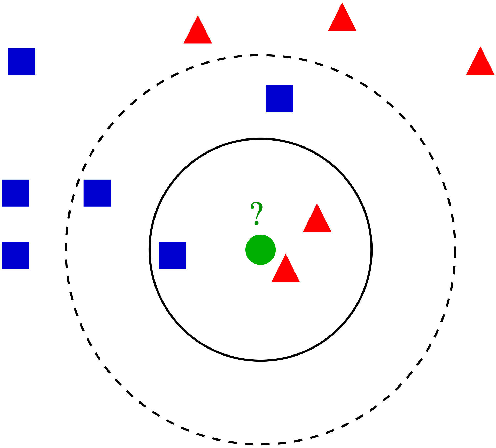
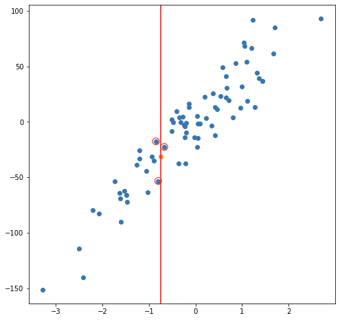

::: watermark

:::


# K-Nearest-Neighbor

KNN es un algoritmo de aprendizaje supervisado que podemos usar tanto para regresión como clasificación. Es un algoritmo fácil de interpretar y que permite ser flexible en el balance entre sesgo y varianza (dependiendo de los hiper-parámetros seleccionados).

El algoritmo de K vecinos más cercanos realiza comparaciones entre un nuevo elemento y las observaciones anteriores que ya cuentan con etiqueta. La esencia de este algoritmo está en **etiquetar a un nuevo elemento de manera similar a como están etiquetados aquellos _K_ elementos que más se le parecen**. Veremos este proceso para cada uno de los posibles casos:


## Clasificación

La idea detrás del algoritmo es sencilla, etiqueta una nueva observación en la categoría que tenga mas elementos de las *k* observaciones más cercanas, es decir:

1. Seleccionamos el hiper-parámetro *K* como el número elegido de vecinos.

2. Se calculará la similitud (distancia) de esta nueva observación a cada observación existente.

3. Ordenaremos estas distancias de menor a mayor.

4. Tomamos las *K* primeras entradas de la lista ordenada.

5. La nueva observación será asignada al grupo que tenga mayor número de observaciones en estas *k* primeras distancias (asignación por moda)


A continuación se ejemplifica este proceso:

```{r, fig.align='center', out.height='400pt', out.width='500pt', echo=F}

```

```{r, out.height='300pt', out.width='250pt', echo=F}
knitr::include_graphics("img/07-ml-knn/20_1_classification_knn.png")
knitr::include_graphics("img/07-ml-knn/20_2_classification_knn.png")
knitr::include_graphics("img/07-ml-knn/20_3_classification_knn.png")
```

**Ejemplo:**

```{r, fig.align='center', out.height='500pt', out.width='700pt', echo=F}
knitr::include_graphics("img/07-ml-knn/3-10-1-knn-clasificacion2.png")
```

> Otro método que permite tener mayor control sobre las clasificaciones es asignar la probabilidad de pertenencia a cada clase de acuerdo con la proporción existente de cada una de las mismas. A partir de dichas probabilidades, el usuario puede determinar el punto de corte que sea más conveniente para el problema a resolver.

## Regresión

En el caso de regresión, la etiqueta de una nueva observación se realiza a través del promedio del valor en las *k* observaciones más cercanas, es decir:

1. Seleccionamos el hiper-parámetro *K* como el número elegido de vecinos.

2. Se calculará la similitud (distancia) de esta nueva observación a cada observación existente

3. Ordenaremos estas distancias de menor a mayor

4. Tomamos las *K* primeras entradas de la lista ordenada.

5. La nueva observación será etiquetada mediante el promedio del valor de las observaciones en estas *k* primeras distancias.

Considerando un modelo de 3 vecinos más cercanos, las siguientes imágenes muestran el proceso de ajuste y predicción de nuevas observaciones.

```{r, out.height='280pt', out.width='250pt', echo=F}

knitr::include_graphics("img/07-ml-knn/3-10-1-regression2.png")
knitr::include_graphics("img/07-ml-knn/3-10-1-regression3.png")
```

**Ejemplo de balance de sesgo y varianza**

```{r, fig.align='center', out.height='500pt', out.width='700pt', echo=F}
knitr::include_graphics("img/07-ml-knn/3-10-1-knn-regresion2.png")
```

## Ajuste del modelo

En contraste con otros algoritmos de aprendizaje supervisado, K-NN no genera un modelo del aprendizaje con datos de entrenamiento, sino que el aprendizaje sucede en el mismo momento en el que se prueban los datos de prueba. A este tipo de algoritmos se les llama *lazy learning methods* porque no aprende del conjunto de entrenamiento inmediatamente, sino que almacena el conjunto de datos y, en el momento de la clasificación, realiza una acción en el conjunto de datos.

El algoritmo *KNN* en la fase de entrenamiento simplemente almacena el conjunto de datos y cuando obtiene nuevos datos, clasifica esos datos en una categoría que es muy similar a los nuevos datos.

### Selección de Hiper-parámetro K

Al configurar un modelo KNN, sólo hay algunos parámetros que deben elegirse/ajustarse para mejorar el rendimiento, uno de estos parámetros es el valor de la K.

No existe una forma particular de determinar el mejor valor para "K", por lo que debemos probar algunos valores para encontrar "el mejor" de ellos. 

Para los modelos de clasificación, especialmente si solo hay dos clases, generalmente se elige un número impar para k. Esto es para que el algoritmo nunca llegue a un "empate"

Una opción para seleccionar la K adecuada es ejecutar el algoritmo KNN varias veces con diferentes valores de K y elegimos la K que reduce la cantidad de errores mientras se mantiene la capacidad del algoritmo para hacer predicciones con precisión.

Observemos lo siguiente:

```{r, fig.align='center', out.height='300pt', out.width='500pt', echo=F}
knitr::include_graphics("img/07-ml-knn/3-10-1-kerror2.png")
```

Estas gráficas se conoce como "gráfica de codo" y generalmente se usan para determinar el valor K.

- A medida que disminuimos el valor de K a 1, nuestras predicciones se vuelven menos estables. Imaginemos que tomamos K = 1 y tenemos un punto de consulta rodeado por varios rojos y uno verde, pero el verde es el vecino más cercano. Razonablemente, pensaríamos que el punto de consulta es probablemente rojo, pero como K = 1, KNN predice incorrectamente que el punto de consulta es verde.

- Inversamente, a medida que aumentamos el valor de K, nuestras predicciones se vuelven más estables debido a que tenemos más observaciones con quienes comparar, por lo tanto, es más probable que hagan predicciones más precisas. Eventualmente, comenzamos a presenciar un número creciente de errores, es en este punto que sabemos que hemos llevado el valor de K demasiado lejos.


### Métodos de cálculo de la distancia entre observaciones

Otro parámetro que podemos ajustar para el modelo es la distancia usada, existen diferentes formas de medir qué tan "cerca" están dos puntos entre sí, y las diferencias entre estos métodos pueden volverse significativas en dimensiones superiores. 

- La más utilizada es la distancia euclidiana, el tipo estándar de distancia.

$$d(X,Y) = \sqrt{\sum_{i=1}^{n} (x_i-y_i)^2}$$

- Otra métrica es la llamada distancia de Manhattan, que mide la distancia tomada en cada dirección cardinal, en lugar de a lo largo de la diagonal.

$$d(X,Y) = \sum_{i=1}^{n} |x_i - y_i|$$

- De manera más general, las anteriores son casos particulares de la distancia de Minkowski, cuya fórmula es:

$$d(X,Y) = (\sum_{i=1}^{n} |x_i-y_i|^p)^{\frac{1}{p}}$$

- La distancia de coseno es ampliamente en análisis de texto, sistemas de recomendación

$$d(X,Y)= 1 - \frac{\sum_{i=1}^{n}{X_iY_i}}{\sqrt{\sum_{i=1}^{n}{X_i^2}}\sqrt{\sum_{i=1}^{n}{Y_i^2}}}$$

```{r, fig.align='center', out.height='700pt', out.width='700pt', echo=F}
knitr::include_graphics("img/07-ml-knn/similitudes.png")
```


* [Un link interesante](https://towardsdatascience.com/17-types-of-similarity-and-dissimilarity-measures-used-in-data-science-3eb914d2681)

* [Otro link interesante](https://www.maartengrootendorst.com/blog/distances/)


## Implementación en Python

Usaremos los pipelines antes implementados para ajustar tanto el modelo de regresión como el de clasificación. Una ventaja que se explorará al usar KFCV es el conjunto de hiperparámetros para elegir el mejor modelo posible.

Los pasos a seguir, son los siguientes:

0. Carga de librerías
1. Carga y separación inicial de datos ( test, train ).
2. Pre-procesamiento e ingeniería de variables.
3. Selección de tipo de modelo con hiperparámetros iniciales.
4. Cálculo de métricas de desempeño.
5. Creación de grid search y métricas de desempeño.
6. Entrenamiento de modelos con hiperparámetros definidos.
7. Análisis de métricas de error e hiperparámetros (Vuelve al paso 3, si es necesario).
8. Selección de modelo a usar.
9. Ajuste de modelo final con todos los datos (Vuelve al paso 2, si es necesario).
10. Validar poder predictivo con datos de prueba.

### Regresión

**Paso 0: Carga de librerías**
```{python}
from mlxtend.feature_selection import ColumnSelector
from sklearn.compose import ColumnTransformer
from sklearn.preprocessing import StandardScaler, OneHotEncoder
from sklearn.neighbors import KNeighborsRegressor
from sklearn.pipeline import Pipeline
from sklearn.metrics import mean_absolute_error, mean_absolute_percentage_error
from sklearn.metrics import mean_squared_error, r2_score, make_scorer
from sklearn.model_selection import train_test_split, KFold, cross_val_score, cross_validate
from sklearn.model_selection import GridSearchCV
from sklearn.utils import shuffle

from plydata.one_table_verbs import pull
from mizani.formatters import comma_format, dollar_format
from plotnine import *
from siuba import *

import pandas as pd
import numpy as np
```


**Paso 1: Carga y separación inicial de datos ( test, train )**

Comenzamos por cargar los datos completos e identificar la variable de respuesta para separarla de las explicativas

```{python}
#### CARGA DE DATOS ####
ames = pd.read_csv("data/ames.csv")

ames_y = ames >> pull("Sale_Price")    # ames[["Sale_Price"]]
ames_x = select(ames, -_.Sale_Price)   # ames.drop('Sale_Price', axis=1)

#### DIVISIÓN DE DATOS ####
ames_x_train, ames_x_test, ames_y_train, ames_y_test = train_test_split(
 ames_x, ames_y, 
 test_size = 0.20, 
 random_state = 195
 )
```

Contando con datos de entrenamiento, procedemos a realizar el feature engineering para extraer las mejores características que permitirán realizar las estimaciones en el modelo.

**Paso 2: Pre-procesamiento e ingeniería de variables**

En este paso se pone a prueba la imaginación y conocimiento de transformaciones estadísticas que permitan ofrecer un mejor ajuste a la relación entre datos dependientes y de respuesta.

EL primer pipeline es para facilitar las transformaciones sobre las columnas sugeridas inicialmente:

```{python, warning=FALSE,message=FALSE}
## SELECCIÓN DE VARIABLES

# Seleccionamos las variales numéricas de interés
num_cols = ["Full_Bath", "Half_Bath"]

# Seleccionamos las variables categóricas de interés
cat_cols = ["Overall_Cond"]

# Juntamos todas las variables de interés
columnas_seleccionadas = num_cols + cat_cols

pipe = ColumnSelector(columnas_seleccionadas)
ames_x_train_selected = pipe.fit_transform(ames_x_train)

ames_train_selected = pd.DataFrame(
  ames_x_train_selected, 
  columns = columnas_seleccionadas
  )

ames_train_selected.info()
```

Y una vez que se han sugerido algunas columnas, se procede a realizar el pipeline de transformación:

```{python, warning=FALSE,message=FALSE}
## TRANSFORMACIÓN DE COLUMNAS

# ColumnTransformer para aplicar transformaciones
preprocessor = ColumnTransformer(
    transformers = [
        ('scaler', StandardScaler(), num_cols),
        ('onehotencoding', OneHotEncoder(drop='first', sparse_output=False), cat_cols)
    ],
    verbose_feature_names_out = False,
    remainder = 'passthrough'  # Mantener las columnas restantes sin cambios
)

transformed_data = preprocessor.fit_transform(ames_train_selected)
new_column_names = preprocessor.get_feature_names_out()

transformed_df = pd.DataFrame(
  transformed_data,
  columns=new_column_names
  )

transformed_df
transformed_df.info()
```

Recordemos que la función **ColumnTransformes()** solo son los pasos a seguir, necesitamos usar el método **fit()** que nos devuelve una receta actualizada con las estimaciones y la función **transform()** que nos devuelve la matriz transformada. Estos pasos pueden resumirse con el método: **fit_transform()**

Una vez que la receta de transformación de datos está lista, procedemos a implementar el pipeline del modelo de interés.

**Paso 3: Selección de tipo de modelo con hiperparámetros iniciales**

Ahora se procede a unir en un mismo flujo el proceso de ingeniería de datos y un modelo inicial sugerido. En este primer ejemplo, se muestra un modelo de 5 vecinos más cercanos.

```{python, warning=FALSE,message=FALSE, eval=TRUE}
# Crear el pipeline con la regresión por KNN
pipeline = Pipeline([
   ('preprocessor', preprocessor),
   ('regressor', KNeighborsRegressor(n_neighbors=5))
])

# Entrenar el pipeline
results = pipeline.fit(ames_train_selected, ames_y_train)

## PREDICCIONES
y_pred = pipeline.predict(ames_x_test)

ames_test = (
  ames_x_test >>
  mutate(Sale_Price_Pred = y_pred, Sale_Price = ames_y_test)
)

(
ames_test >>
  select(_.Sale_Price, _.Sale_Price_Pred)
)
```

Estas son las predicciones logradas con el modelo inicial.

#### Métricas de desempeño

Se procede en el siguiente paso a cuantificar los errores producidos por la predicción.

**Paso 4: Cálculo de métricas de desempeño**

```{python, warning=FALSE,message=FALSE, eval=TRUE}
pd.options.display.float_format = '{:.2f}'.format

y_obs = ames_test["Sale_Price"]
y_pred = ames_test["Sale_Price_Pred"]

me = np.mean(y_obs - y_pred)
mae = mean_absolute_error(y_obs, y_pred)
mape = mean_absolute_percentage_error(y_obs, y_pred)
mse = mean_squared_error(y_obs, y_pred)
rmse = np.sqrt(mse)
r2 = r2_score(y_obs, y_pred)

n = len(y_obs)  # Número de observaciones
p = 9  # Número de predictores 
r2_adj = 1 - (n - 1) / (n - p - 1) * (1 - r2)

metrics_data = {
    "Metric": ["ME", "MAE", "MAPE", "MSE", "RMSE", "R^2", "R^2 Adj"],
    "Value": [me, mae, mape, mse, rmse, r2, r2_adj]
}

metrics_df = pd.DataFrame(metrics_data)
metrics_df
```

Una manera amigable de dimensionar los errores y el buen desempeño es mediante gráficos

```{python}
#### Gráficos de desempeño de modelo

(
  ames_test >>
    ggplot(aes(x = "Sale_Price", y = "Sale_Price_Pred")) +
    geom_point() +
    scale_y_continuous(labels = dollar_format(digits=0, big_mark=','), limits = [0, 600000] ) +
    scale_x_continuous(labels = dollar_format(digits=0, big_mark=','), limits = [0, 500000] ) +
    geom_abline(color = "red") +
    coord_equal() +
    labs(
      title = "Comparación entre predicción y observación",
      y = "Predicción",
      x = "Observación")
)


(
ames_test >>
  select(_.Sale_Price, _.Sale_Price_Pred) >>
  mutate(error = _.Sale_Price - _.Sale_Price_Pred) >>
  ggplot(aes(x = "error")) +
  geom_histogram(color = "white", fill = "black") +
  geom_vline(xintercept = 0, color = "red") +
  scale_x_continuous(labels=dollar_format(big_mark=',', digits=0)) + 
  ylab("Conteos de clase") + xlab("Errores") +
  ggtitle("Distribución de error")
)


(
ames_test >>
  select(_.Sale_Price, _.Sale_Price_Pred) >>
  mutate(error = _.Sale_Price - _.Sale_Price_Pred) >>
  ggplot(aes(sample = "error")) +
  geom_qq(alpha = 0.3) + stat_qq_line(color = "red") +
  scale_y_continuous(labels=dollar_format(big_mark=',', digits = 0)) + 
  xlab("Distribución normal") + ylab("Distribución de errores") +
  ggtitle("QQ-Plot")
)


(
ames_test >>
  select(_.Sale_Price, _.Sale_Price_Pred) >>
  mutate(error = _.Sale_Price - _.Sale_Price_Pred) >>
  ggplot(aes(x = "Sale_Price")) +
  geom_linerange(aes(ymin = 0, ymax = "error"), colour = "purple") +
  geom_point(aes(y = "error"), size = 0.05, alpha = 0.5) +
  geom_abline(intercept = 0, slope = 0) +
  scale_x_continuous(labels=dollar_format(big_mark=',', digits=0)) + 
  scale_y_continuous(labels=dollar_format(big_mark=',', digits=0)) +
  xlab("Precio real") + ylab("Error de estimación") +
  ggtitle("Relación entre error y precio de venta")
)
```

#### Validación cruzada

Para determinar cuáles son los hiper-parámetros que funcionan mejor, es necesario realizar experimentos mediante **ensayo-error** hasta determinar la mejor solución. En cada partición del método de muestreo *KFCV* se implementan las distintas configuraciones y se calculan predicciones. Con las predicciones hechas en cada *fold*, se obtienen intervalos de confianza para conocer la variación asociada al modelo a través de los hiper-parámetros implementados.

Usaremos las recetas antes implementadas para ajustar tanto el modelo de regresión como el de clasificación. Exploraremos un conjunto de hiperparámetros para elegir el mejor modelo, sin embargo, para realizar este proceso de forma ágil, se inicializará un flujo de trabajo que se encargue de realizar todos los experimentos deseados y elegir el modelo adecuado. 

**Paso 5: Creación de grid search y métricas de desempeño**

```{python, warning=FALSE,message=FALSE, eval=TRUE}
# Definir el objeto K-Fold Cross Validator
k = 10
kf = KFold(n_splits=k, shuffle=True, random_state=42)

param_grid = {
 'n_neighbors': range(2, 21),
 'weights': ['uniform', 'distance'],
 'metric': ['euclidean', 'manhattan'],
 'p': [1, 2]
}
```

Algunas otras posibles distancias son:

* euclidean
* manhattan
* chebyshev
* minkowski
* hamming
* jaccard
* cosine

Una vez definidos los posibles hiperparámetros, procedemos a definir las métricas que serán usadas para cuantificar la bondad del ajuste.

```{python, warning=FALSE,message=FALSE, eval=TRUE}
# Definir las métricas de desempeño que deseas calcular como funciones de puntuación

def adjusted_r2_score(y_true, y_pred, n, p):
  r2 = r2_score(y_true, y_pred)
  adjusted_r2 = 1 - (1 - r2) * (n - 1) / (n - p - 1)
  return adjusted_r2

scoring = {
    'neg_mean_squared_error': make_scorer(mean_squared_error, greater_is_better=False),
    'r2': make_scorer(adjusted_r2_score, greater_is_better=True, 
                      n=np.ceil(len(ames_train_selected)), p=len(ames_train_selected.columns)),
    'neg_mean_absolute_error': make_scorer(mean_absolute_error, greater_is_better=False),
    'mape': make_scorer(mean_absolute_percentage_error, greater_is_better=False)
}
```

**Paso 6: Entrenamiento de modelos con hiperparámetros definidos**

Teniendo todos los elementos anteriores listos, se procede con el ajuste de todas las posibles configuraciones del modelo a través de la validación cruzada. Esto permitirá contar con medidas de tendencia central para los resultados de cada uno de las configuraciones y evaluar si estadísticamente hay diferencia entre los mejores resultados.

```{python, warning=FALSE,message=FALSE}
pipeline = Pipeline([
    ('preprocessor', preprocessor),
    ('regressor', GridSearchCV(
      KNeighborsRegressor(), 
      param_grid, 
      cv=kf, 
      scoring=scoring, 
      refit='neg_mean_squared_error',
      verbose=3, 
      n_jobs=-1)
     )
])

pipeline.fit(ames_train_selected, ames_y_train)

```


**Paso 7: Análisis de métricas de error e hiperparámetros (Vuelve al paso 3, si es necesario)**

Podemos obtener las métricas de los resultados de cada *fold*:

```{python}
results_cv = pipeline.named_steps['regressor'].cv_results_

# Convierte los resultados en un DataFrame
pd.set_option('display.max_columns', 500)
results_df = pd.DataFrame(results_cv)
results_df.columns

# Puedes seleccionar las columnas de interés, por ejemplo:

summary_df = (
  results_df >>
  select(-_.contains("split"), -_.contains("time"), -_.params)
)
summary_df
```

En la siguiente gráfica observamos las distintas métricas de error asociados a los hiperparámetros elegidos:

```{python}
(
  summary_df >>
  ggplot(aes(x = "param_n_neighbors", y = "mean_test_r2", size = "param_p",
             color = "param_metric", shape = "param_weights")) +
  geom_point(alpha = 0.65) +
  ggtitle("Parametrización de KNN vs R^2") +
  xlab("Parámetro: Número de vecinos cercanos") +
  ylab("R^2 promedio")
)
```

Seleccionando la mejor parametrización, se puede definir la siguiente gráfica para comparar la diferencia entre hiperparámetros a un nivel más granular.

```{python}
(
  summary_df >>
  filter(
    _.param_weights == "uniform",
    _.param_p == 1,
    _.param_metric == "manhattan") >>
  mutate(
    ymin = np.maximum(0, _.mean_test_r2 - _.std_test_r2),
    ymax = np.minimum(1, _.mean_test_r2 + _.std_test_r2)) >>
  ggplot(aes(x = "param_n_neighbors", y = "mean_test_r2")) +
  geom_errorbar(aes(ymin='ymin', ymax='ymax'),
    width=0.3, position=position_dodge(0.9)) +
  geom_point(alpha = 0.65) +
  ggtitle("Parametrización de KNN vs R^2") +
  xlab("Parámetro: Número de vecinos cercanos") +
  ylab("R^2 promedio")
)

```

En la anterior gráfica observamos la `R^2` con distintos números de vecinos.


**Paso 8: Selección de modelo a usar**

Habiendo realizado un análisis de los hiperparámetros, se procede a elegir el mejor modelo. Esto a veces a muy evidente y otras no. En cualquier caso, puede automatizarse la extracción del mejor modelo:

```{python}
best_params = pipeline.named_steps['regressor'].best_params_
best_params
```

Sabiendo cuáles son los mejores hiperparámetros, se procede a extraer el modelo que **DEBEREMOS AJUSTAR A TODOS LOS DATOS DE ENTRENAMIENTO**.


```{python}
best_estimator = pipeline.named_steps['regressor'].best_estimator_
best_estimator
```

**Paso 9: Ajuste de modelo final con todos los datos (Vuelve al paso 2, si es necesario)**

Ahora obtendremos el modelo que mejor desempeño tiene y haremos las predicciones del conjunto de prueba con este modelo.

Es importante volver a hacer el ajuste con el modelo elegido.

```{python}
final_knn_pipeline = Pipeline([
   ('preprocessor', preprocessor),
   ('regressor', best_estimator)
])

# Entrenar el pipeline
final_knn_pipeline.fit(ames_train_selected, ames_y_train)
```

Este último objeto creado es el modelo final entrenado, el cual contiene toda la información del pre-procesamiento de datos, por lo que en caso de ponerse en producción, sólo se necesita de los nuevos datos y de este último elemento para poder realizar nuevas predicciones. 


**Paso 10: Validar poder predictivo con datos de prueba**

Imaginemos por un momento que pasa un mes de tiempo desde que hicimos nuestro modelo, es hora de ponerlo a prueba prediciendo valores de nuevos elementos:

```{python}
## Predicciones finales
y_pred_knn = final_knn_pipeline.predict(ames_x_test)

results_reg = (
  ames_x_test >>
  mutate(final_knn_pred = y_pred_knn, Sale_Price = ames_y_test) >>
  select(_.Sale_Price, _.final_knn_pred)
)
results_reg
```

**Métricas de desempeño**

Ahora para calcular las métricas de desempeño usaremos la paquetería *MLmetrics*. Es posible definir nuestro propio conjunto de métricas que deseamos reportar creando el objeto *metric_set*:

```{python}
me = np.mean(y_obs - y_pred_knn)
mae = mean_absolute_error(y_obs, y_pred_knn)
mape = mean_absolute_percentage_error(y_obs, y_pred_knn)
mse = mean_squared_error(y_obs, y_pred_knn)
rmse = np.sqrt(mse)
r2 = r2_score(y_obs, y_pred_knn)
r2_adj = adjusted_r2_score(y_true = y_obs, y_pred = y_pred_knn,
  n=np.ceil(len(ames_train_selected)), p=len(ames_train_selected.columns))

metrics_data = {
    "Metric": ["ME", "MAE", "MAPE", "MSE", "RMSE", "R^2", "R^2 Adj"],
    "Value": [me, mae, mape, mse, rmse, r2, r2_adj]
}

metrics_df = pd.DataFrame(metrics_data)
metrics_df
```

```{python}
(
  results_reg >>
    ggplot(aes(x = "final_knn_pred", y = "Sale_Price")) +
    geom_point() +
    geom_abline(color = "red") +
    xlab("Prediction") +
    ylab("Observation") +
    ggtitle("Comparisson")
)
```

#### Importancia de variables

Antes de pasar al siguiente paso, es importante validar que hayamos hecho un uso correcto de las variables predictivas. En este momento es posible detectar variables que no estén aportando valor o variables que no debiéramos estar usando debido a que cometeríamos [data leakage](https://towardsdatascience.com/data-leakage-in-machine-learning-6161c167e8ba). Para enfrentar esto, ayuda estimar y ordenar el valor de importancia de cada variable en el modelo.

```{python}
importance = np.zeros(ames_x_test[columnas_seleccionadas].shape[1])

# Realiza el procedimiento de permutación
for i in range(ames_x_test[columnas_seleccionadas].shape[1]):
    ames_x_test_permuted = ames_x_test[columnas_seleccionadas].copy()
    ames_x_test_permuted.iloc[:, i] = shuffle(ames_x_test_permuted.iloc[:, i], random_state=42)  
    # Permuta una característica
    y_pred_permuted = final_knn_pipeline.predict(ames_x_test_permuted)
    mse_permuted = mean_squared_error(ames_y_test, y_pred_permuted)
    importance[i] = mse - mse_permuted

# Calcula la importancia relativa
importance = importance / importance.sum()
importance

importance_df = pd.DataFrame({
  'Variable': columnas_seleccionadas, 
  'Importance': importance
  })

# Crea la gráfica de barras
(
  importance_df >>
  ggplot(aes(x= 'reorder(Variable, Importance)', y='Importance')) + 
  geom_bar(stat='identity', fill='blue', color = "black") + 
  labs(title='Importancia de las Variables', x='Variable', y='Importancia') +
  coord_flip()
)

```

La gráfica anterior muestra la importancia de una variable cuando se lleva a cabo una permutación. Dado que este resultado fue aleatorio, resulta vital contar con un conjunto de permutaciones que permitan conocer la caída promedio y desviación esperada en el desempeño cuando se elimina una variable o esta se vuelve inservible.

```{python}
n_permutations = 50
performance_losses = []

for i in range(ames_x_test[columnas_seleccionadas].shape[1]):
    loss = []
    for j in range(n_permutations):
        ames_x_test_permuted = ames_x_test[columnas_seleccionadas].copy()
        ames_x_test_permuted.iloc[:, i] = np.random.permutation(ames_x_test_permuted.iloc[:, i])
        y_pred_permuted = final_knn_pipeline.predict(ames_x_test_permuted)
        mse_permuted = mean_squared_error(ames_y_test, y_pred_permuted)
        loss.append(mse_permuted)
    performance_losses.append(loss)

performance_losses = performance_losses/np.sum(performance_losses, axis=0)
mean_losses = np.mean(performance_losses, axis=1)
std_losses = np.std(performance_losses, axis=1)

importance_df = pd.DataFrame({
  'Variable': columnas_seleccionadas, 
  'Mean_Loss': mean_losses, 
  'Std_Loss': std_losses
  })
```

```{python}
(
  importance_df >>
  mutate(
    ymin = _.Mean_Loss - _.Std_Loss,
    ymax = _.Mean_Loss + _.Std_Loss) >>
  ggplot(aes(x = 'reorder(Variable, Mean_Loss)', y = "Mean_Loss")) +
  geom_errorbar(aes(ymin='ymin', ymax='ymax'),
    width=0.2, position=position_dodge(0.9)) +
  geom_point(alpha = 0.65) +
  labs(title='Importancia de las Variables', x='Variable', y='Importancia') +
  coord_flip()
)
```


Si en la gráfica anterior notamos algo raro en cuanto a la(s) variable(s) más importante(s) y la factibilidad de conseguirla(s) o usarla(s)... ¡¡HAY QUE EMPEZAR DESDE CERO SIN CONSIDERAR ESA VARIABLE!!


