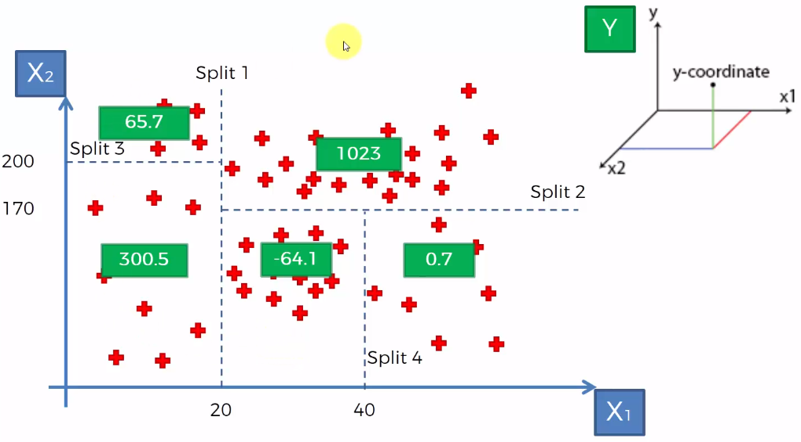

::: watermark

:::


# Árboles de decisión

```{r, fig.align='center', out.height='600pt', out.width='500pt', echo=F}
knitr::include_graphics("img/08-ml-tree/0-meme-arbol.jpeg")
```


Un árbol de decisiones es un algoritmo del aprendizaje supervisado que se puede utilizar tanto para problemas de **clasificación** como de **regresión**. Es un clasificador estructurado en árbol, donde los nodos internos representan las características de un conjunto de datos, las ramas representan las reglas de decisión y cada nodo hoja representa el resultado. La idea básica de los árboles es buscar puntos de cortes en las variables de entrada para hacer predicciones, ir dividiendo la muestra, y encontrar cortes sucesivos para refinar las predicciones.


En un árbol de decisión, hay dos tipos nodos, el nodo de decisión o nodos internos (*Decision Node*) y el nodo hoja o nodo terminal (Leaf node). Los nodos de decisión se utilizan para tomar cualquier decisión y tienen múltiples ramas, mientras que los nodos hoja son el resultado de esas decisiones y no contienen más ramas.

```{r, fig.align='center', out.height='300pt', out.width='500pt', echo=F}
knitr::include_graphics("img/08-ml-tree/1-arboles.png")
```

- **Regresión:** En el caso de la regresión de árboles de decisión, en los nodos finales se calcula el promedio de la variable de respuesta. El promedio será la estimación del modelo.

```{r, fig.align='center', out.height='300pt', out.width='500pt', echo=F}

```

```{r, fig.align='center', out.height='300pt', out.width='500pt', echo=F}
knitr::include_graphics("img/08-ml-tree/3-arbol-reg-diagram.png")
```

```{r, fig.align='center', out.height='300pt', out.width='500pt', echo=F}
#knitr::include_graphics("img/08-ml-tree/ejemplocla.jpeg")
```

- **Clasificación:** Por otro lado, en los árboles de clasificación se calcula la proporción de elementos de cada categoría en los nodos finales. De esta manera se calcula la probabilidad de pertenencia a la categoría.

```{r, fig.align='center', out.height='300pt', out.width='500pt', echo=F}
knitr::include_graphics("img/08-ml-tree/4-arbol-cla-graph.png")
```

```{r, fig.align='center', out.height='300pt', out.width='500pt', echo=F}
knitr::include_graphics("img/08-ml-tree/5-arbol-cla-diagram.png")
```


```{r, fig.align='center', out.height='300pt', out.width='500pt', echo=F, eval=F}
knitr::include_graphics("img/08-ml-tree/ejemploreg.png")
```


## Ajuste del modelo

En un árbol de decisión, para predecir la clase del conjunto de datos, el algoritmo comienza desde el nodo raíz del árbol. Este algoritmo compara los valores de la variable raíz con la variable de registro y, según la comparación, sigue una rama y salta al siguiente nodo.

Para el siguiente nodo, el algoritmo vuelve a comparar el valor de la siguiente variable con los otros sub-nodos y avanza. Continúa el proceso hasta que se llega a un nodo hoja. El proceso completo se puede comprender mejor con los siguientes pasos: 

1) Comenzamos el árbol con el nodo raíz (llamado S), que contiene el conjunto de entrenamiento completo.

2) Encuentre la mejor variable en el conjunto de datos usando *Attribute Selective Measure* (ASM).

3) Divida la S en subconjuntos que contengan valores posibles para la mejor variable.

4) Genere el nodo del árbol de decisión, que contiene la mejor variable.

5) Cree de forma recursiva nuevos árboles de decisión utilizando los subconjuntos del conjunto de datos creado en el paso 3. Continúe este proceso hasta que se alcance una etapa en la que no pueda particionar más los nodos y este nodo final sera un nodo hoja.

6) Para clasificación nos quedaremos la moda de la variable respuesta del nodo hoja y para regresión usaremos la media de la variable respuesta.

### Attribute Selective Measure (ASM)

Al implementar un árbol de decisión, surge el problema principal de cómo seleccionar la mejor variable para el nodo raíz y para los sub-nodos. Para resolver este problemas existe una técnica que se llama medida de selección de atributos o *ASM*. Mediante esta medición, podemos seleccionar fácilmente la mejor variable para los nodos del árbol. Una de las técnicas más populares para *ASM* es:

- Índice de Gini

La medida del grado de probabilidad de que una variable en particular se clasifique incorrectamente cuando se elige al azar se llama índice de Gini o impureza de Gini. Los datos se distribuyen por igual según el índice de Gini.

$$Gini = \sum_{i=1}^{n}\hat{p_i}(1-\hat{p}_i)$$

Con $p_i$ como la probabilidad de que un objeto se clasifique en una clase particular.

Esta métrica puede analizarse como una métrica de impureza. Cuando todos o la mayoría de elementos dentro de un nodo pertenecen a una misma clase, el índice de Gini toma valores cercanos a cero.

Cuando se utiliza el índice de Gini como criterio seleccionar la variable para el nodo raíz, seleccionaremos la variable con el índice de Gini menor.


## Regularización de árboles

Para asegurarse de que no exista sobre-ajuste en el modelo, es importante considerar algunas regularizaciones a los hiper-parámetros implementados. Posteriormente, se determinará cuál de las posibles combinaciones produce mejores resultados.

### Nivel de profundidad de árbol

Podríamos preguntarnos cuándo dejar de crecer un árbol. Pueden existir problemas que tengan un gran conjunto de variables y esto da como resultado una gran cantidad de divisiones, lo que a su vez genera un árbol de decisión muy grande. Estos árboles son complejos y pueden provocar un sobre-ajuste. Entonces, necesitamos saber cuándo parar.

1) Una forma de hacer esto, es establecer un número mínimo de entradas de entrenamiento para dividir un nodo (min_n). 

2) Otra forma, es establecer la profundidad máxima del modelo. La profundidad máxima se refiere a la longitud del camino más largo desde el nodo raíz hasta un nodo hoja (max_depth).


## Aprendizaje conjunto

El aprendizaje conjunto da crédito a la idea de la “sabiduría de las multitudes”, lo que sugiere que **la toma de decisiones de un grupo más grande de individuos (modelos) suele ser mejor que la de un individuo.**

El aprendizaje en conjunto **es un grupo (o conjunto) de individuos o modelos, que trabajan colectivamente para lograr una mejor predicción final**. Un solo modelo, también conocido como aprendiz básico puede no funcionar bien individualmente debido a una gran variación o un alto sesgo, sin embargo, cuando se agregan individuos débiles, pueden formar un individuo fuerte, ya que su combinación reduce el sesgo o la varianza, lo que produce un mejor rendimiento del modelo.

```{r echo=FALSE,fig.align='center', out.height='250pt', out.width='600pt'}
knitr::include_graphics("img/08-ml-tree/10-inteligencia-colectiva.jpeg")
```

Los métodos de conjunto se ilustran con frecuencia utilizando árboles de decisión, ya que este algoritmo puede ser propenso a sobre ajustar (alta varianza y bajo sesgo) y también puede prestarse a desajuste (baja varianza y alto sesgo) cuando es muy pequeño, como un árbol de decisión con un nivel. 

**Nota:** Cuando un algoritmo se adapta o no se adapta a su conjunto de entrenamiento, no se puede generalizar bien a nuevos conjuntos de datos, por lo que se utilizan métodos de conjunto para contrarrestar este comportamiento y permitir la generalización del modelo a nuevos conjuntos de datos.


## Bagging

Primero tenemos que definir qué es la **Agregación de Bootstrap o Bagging**. Este es un algoritmo de aprendizaje automático diseñado para mejorar la estabilidad y precisión de algoritmos de ML usados en clasificación estadística y regresión. Además reduce la varianza y ayuda a evitar el sobre-ajuste. Aunque es usualmente aplicado a métodos de árboles de decisión, puede ser usado con cualquier tipo de método. Bagging es un caso especial del promediado de modelos.

```{r, fig.align='center', out.height='450pt', out.width='800pt', echo=F}
knitr::include_graphics("img/08-ml-tree/bootstrap.svg")
```

Los métodos de *bagging* son métodos donde los algoritmos simples son usados en paralelo. El principal objetivo de los métodos en paralelo es el de aprovecharse de la independencia que hay entre los algoritmos simples, ya que el error se puede reducir bastante al promediar las salidas de los modelos simples. Es como si, queriendo resolver un problema entre varias personas independientes unas de otras,  damos por bueno lo que eligiese la mayoría de las personas.

Para obtener la agregación de las salidas de cada modelo simple e independiente, bagging puede usar la votación para los métodos de clasificación y el promedio para los métodos de regresión.

```{r, fig.align='center', out.height='300pt', out.width='500pt', echo=F}
knitr::include_graphics("img/08-ml-tree/7-bag.png")
```

El *bagging o agregación bootstrap*, es un método de aprendizaje por conjuntos que se usa comúnmente para reducir la varianza dentro de un conjunto de datos ruidoso.


## Random Forest

Un bosque aleatorio es un algoritmo de aprendizaje automático supervisado que se construye a partir de algoritmos de árbol de decisión. Este algoritmo se aplica en diversas industrias, como la banca y el comercio electrónico, para predecir el comportamiento y los resultados.

En esta clase se dará una descripción general del algoritmo de bosque aleatorio, cómo funciona y las características del algoritmo.

También se señalan las ventajas y desventajas de este algoritmo.

```{r echo=FALSE,fig.align='center', out.height='500pt', out.width='900pt'}
knitr::include_graphics("img/08-ml-tree/bagging.jpeg")
```

### ¿Qué es?

Un bosque aleatorio es una técnica de aprendizaje automático que se utiliza para resolver problemas de regresión y clasificación. Utiliza el aprendizaje por conjuntos, que es una técnica que combina muchos clasificadores para proporcionar soluciones a problemas complejos.

Este algoritmo consta de muchos árboles de decisión. El "bosque" generado se entrena
mediante **agregación de bootstrap (bagging)**, el cual es es un meta-algoritmo
de conjunto que mejora la precisión de los algoritmos de aprendizaje automático.

El algoritmo establece el resultado en función de las predicciones de los árboles de decisión. Predice tomando el promedio o la media de la salida de varios árboles. El aumento del número de árboles aumenta la precisión del resultado.

Un bosque aleatorio erradica las limitaciones de un algoritmo de árbol de decisión. Reduce el sobre-ajuste de conjuntos de datos y aumenta la precisión. Genera predicciones sin requerir muchas configuraciones.


```{r, fig.align='center', out.height='300pt', out.width='600pt', echo=F, include=TRUE}
knitr::include_graphics("img/08-ml-tree/3-10-1-bosques-aleatorios.png")
```

### Características de los bosques aleatorios

* Es más preciso que el algoritmo árbol de decisiones.

* Proporciona una forma eficaz de gestionar los datos faltantes.

* Puede producir una predicción razonable sin ajuste de hiperparámetros.

* Resuelve el problema del sobre-ajuste en los árboles de decisión.

* En cada árbol forestal aleatorio, se selecciona aleatoriamente un subconjunto
  de características en el punto de división del nodo.


### Aplicar árboles de decisión en un bosque aleatorio

La principal diferencia entre el algoritmo de árbol de decisión y el algoritmo de bosque aleatorio es que el establecimiento de nodos raíz y la desagregación de nodos se realiza de forma aleatoria en este último. **El bosque aleatorio emplea el método de bagging para generar la predicción requerida.**

**El método bagging implica el uso de diferentes muestras de datos (datos de entrenamiento) en lugar de una sola muestra.** Los árboles de decisión producen diferentes resultados, dependiendo de los datos de entrenamiento alimentados al algoritmo de bosque aleatorio. 

Nuestro primer ejemplo todavía se puede utilizar para explicar cómo funcionan los bosques aleatorios. Supongamos que solo tenemos cuatro árboles de decisión. En este caso, los datos de entrenamiento que comprenden las observaciones y características de estudio se dividirán en cuatro nodos raíz. Supongamos que queremos modelar si un cliente compra o no compra un teléfono.

Los nodos raíz podrían representar cuatro características que podrían influir en la elección de un cliente (precio, almacenamiento interno, cámara y RAM). **El bosque aleatorio dividirá los nodos seleccionando características al azar. La predicción final se seleccionará en función del resultado de los cuatro árboles.**

**El resultado elegido por la mayoría de los árboles de decisión será la elección final.**

Si tres árboles predicen la compra y un árbol predice que no comprará, entonces la predicción final será la compra. En este caso, se prevé que el cliente comprará.

El siguiente diagrama muestra un clasificador de bosque aleatorio simple.

```{r, fig.align='center', out.height='300pt', out.width='600pt', echo=F, include=TRUE}
knitr::include_graphics("img/08-ml-tree/3-10-3-bosques-aleatorios-clasificador.png")
```


```{r, fig.align='center', out.height='300pt', out.width='600pt', echo=F, include=TRUE}
knitr::include_graphics("img/08-ml-tree/3-13-1-randomforest.png")
```

### Ventajas y desventjas de bosques aleatorios

**Ventajas**

* Puede realizar tareas de regresión y clasificación.

* Un bosque aleatorio produce buenas predicciones que se pueden entender fácilmente.

* Puede manejar grandes conjuntos de datos de manera eficiente.

* Proporciona un mayor nivel de precisión en la predicción de resultados sobre el algoritmo del árbol de decisión.

**Desventajas**

* Cuando se usa un bosque aleatorio, se requieren bastantes recursos para el cálculo.

* Consume más tiempo en comparación con un algoritmo de árbol de decisiones.

* No producen buenos resultados cuando los datos son muy escasos. En este caso, el subconjunto de características y la muestra de arranque producirán un espacio invariante. Esto conducirá a divisiones improductivas, que afectarán el resultado.


## Implementación


... 


Pueden usar la app de [shiny](https://acturio.shinyapps.io/confusion_matrix/?_ga=2.157345976.322506426.1653670259-130075619.1646374742) que nos permite jugar con el threshold de clasificación para tomar la mejor decisión.


