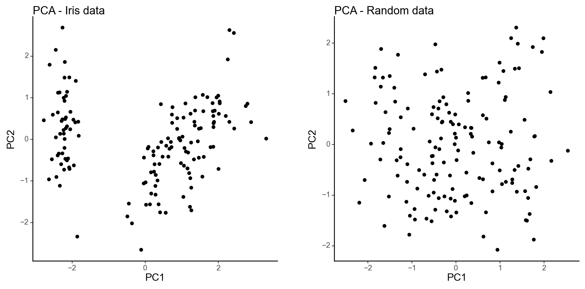
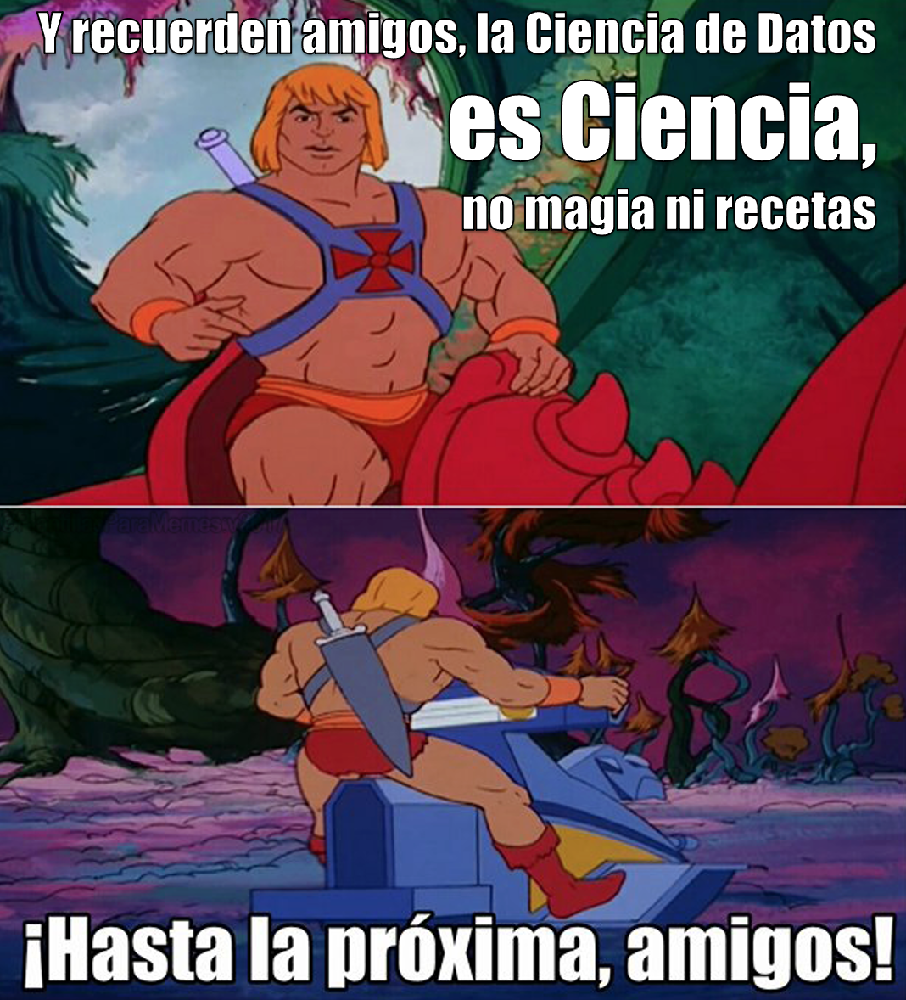

<div class="watermark"></div>

# Clustering No Jerárquico


## Cálculo de distancia

Otro parámetro que podemos ajustar para el modelo es la distancia usada, existen diferentes formas de medir qué tan "cerca" están dos puntos entre sí, y las diferencias entre estos métodos pueden volverse significativas en dimensiones superiores. 

- La más utilizada es la distancia **euclidiana**, el tipo estándar de distancia.

$$d(X,Y) = \sqrt{\sum_{i=1}^{n} (x_i-y_i)^2}$$

- Otra métrica es la llamada distancia de **Manhattan**, que mide la distancia tomada en cada dirección cardinal, en lugar de a lo largo de la diagonal.

$$d(X,Y) = \sum_{i=1}^{n} |x_i - y_i|$$

- De manera más general, las anteriores son casos particulares de la distancia de **Minkowski**, cuya fórmula es:

$$d(X,Y) = (\sum_{i=1}^{n} |x_i-y_i|^p)^{\frac{1}{p}}$$

- La distancia de **coseno** es ampliamente en análisis de texto, sistemas de recomendación.

$$d(X,Y)= 1 - \frac{\sum_{i=1}^{n}{X_iY_i}}{\sqrt{\sum_{i=1}^{n}{X_i^2}}\sqrt{\sum_{i=1}^{n}{Y_i^2}}}$$

- La distancia de **Jaccard** es ampliamente usada para medir similitud cuando se trata de variables categóricas. Es usado en análisis de texto y sistemas de recomendación.

$$d(X, Y) = \frac{X \cap Y}{X \cup Y}$$

- La distancia de **Gower´s** mide la similitud entre variables de forma distinta dependiendo del tipo de dato (numérica, nominal, ordinal).

$$D_{Gower}(X_1, X_2) = 1 - \frac{1}{p} \sum_{j=1}^{p}{s_j(X_1, X_2)} ; \quad \quad s_j(X_1, X_2)=1-\frac{|y_{1j}-y_{2j}|}{R_j} $$
Para mayor detalle sobre el funcionamiento de la métrica, revisar el siguiente [link](https://medium.com/analytics-vidhya/gowers-distance-899f9c4bd553)

```{r, fig.align='center', out.height='700pt', out.width='700pt', echo=F}
knitr::include_graphics("img/09-not-hclus/01-similitudes.png")
```


* [Un link interesante](https://towardsdatascience.com/17-types-of-similarity-and-dissimilarity-measures-used-in-data-science-3eb914d2681)

* [Otro link interesante](https://www.maartengrootendorst.com/blog/distances/)

### Distancias homogéneas

Las distancias basadas en la correlación son ampliamente usadas en múltiples análisis. Esta medida puede calcularse mediante *pearson*, *spearman* o *kendall*.

```{python, warning=FALSE, message=FALSE, fig.show='hold'}
from sklearn.preprocessing import scale
from sklearn.metrics import pairwise_distances
from sklearn.datasets import load_iris
from pyclustertend import vat, ivat, hopkins # from github git@github.com:lachhebo/pyclustertend.git
import pandas as pd
import numpy as np
import matplotlib.pyplot as plt

USArrests = pd.read_csv("data/USArrests.csv", index_col=0)

# Escalar los datos
USArrests_scaled = scale(USArrests)

dist_cor = pairwise_distances(USArrests_scaled, metric='correlation')

# Imprimir la matriz de distancias
print(np.round(dist_cor[0:7, 0:7], 1))
```


### Visualización de distancias

En cualquier análisis, es de gran valor contar con un gráfico que permita conocer de manera práctica y simple el resumen de distancias. Un mapa de calor es una solución bastante útil, el cual representará de en una escala de color a los elementos cerca y lejos. 


```{python, fig.show='hold'}
plt.clf()
plt.figure(figsize=(4, 4))  
vat(dist_cor, figure_size = (4, 4))
plt.title('Gráfico VAT (Visual Assessment of Cluster Tendency)')
plt.show()

plt.clf()
ivat(dist_cor, figure_size = (4, 4))
plt.title('Gráfico VAT mejorado')
plt.show()
```


La intensidad del color es proporcional al valor de similaridad entre observaciones.
Cuando la distancia es cero, el color es negro y cuando la distancia es amplia, el color es blanco. Los elementos que pertenecen a un mismo cluster se muestran en orden consecutivo.


## Tendencia de factibilidad

Este análisis es considerado como la evaluación de factibilidad de implementar análisis de clustering. Antes de aplicar cualquier técnica de clustering vale la pena **evaluar si el conjunto de datos contiene clusters naturales significativos** (i.e. estructuras no aleatorias) o no. En caso de que sí existan estructuras conglomeradas naturales, se deberá proceder a identificar el número de clusters a extraer. 

```{r, echo=FALSE, fig.align='center', out.width='600pt', fig.show='hold'}

```

A diferencia de otros tipos de análisis, una desventaja que tiene el análisis de clustering es que en todo momento regresarán clusters incluso cuando los datos no contengan tal estructura, por lo que si **ciegamente** se implementa un método de clustering, este dividirá los datos en clusters debido a que es lo esperado a realizar.

```{python}
iris = pd.DataFrame(load_iris().data, columns=load_iris().feature_names)

# Generar un DataFrame aleatorio con las mismas dimensiones que iris
random_df = pd.DataFrame(
  np.random.uniform(
    iris.min(axis=0), 
    iris.max(axis=0), 
    size=iris.shape),
    columns=load_iris().feature_names
    )

df = iris.copy()
```

Se comienza con una evaluación visual sobre los datos para evaluar la significancia de los clusters. Debido a que los más probable es que los datos tengan más de dos dimensiones, se aprovecha el análisis de componentes principales para representar los datos en un espacio de dimensión menor.

```{python}
import patchworklib as pw
from plotnine import *
from sklearn.decomposition import PCA
from sklearn.preprocessing import StandardScaler

def plot_pca(data, title):
  # Escala los datos utilizando StandardScaler
  scaler = StandardScaler()
  data_scaled = scaler.fit_transform(data)

  # Realiza el análisis de componentes principales (PCA)
  pca = PCA(n_components=2)
  principal_components = pca.fit_transform(data_scaled)
  df_pca = pd.DataFrame(data=principal_components, columns=['PC1', 'PC2'])

  return(
      ggplot(df_pca, aes(x='PC1', y='PC2'))
      + geom_point()
      + labs(title=title)
      + theme_classic()
  )

```


```{python, eval=F}
iris_plot = plot_pca(df, "PCA - Iris data")
random_plot = plot_pca(random_df, "PCA - Random data")

iris_plot2 = pw.load_ggplot(iris_plot, figsize=(4,4))
random_plot2 = pw.load_ggplot(random_plot, figsize=(4,4))

iris_plot_vs_random_plot = (iris_plot2|random_plot2)
iris_plot_vs_random_plot.savefig("img/09-not-hclus/iris_plot_vs_random_plot2.png")
```

```{r, echo=FALSE, fig.align='center', out.width='600pt', fig.show='hold'}

```

Puede observarse en el primer gráfico que, al menos existen 2 clusters significativos, con posibilidad de que sean 3. A diferencia del gráfico de la derecha que no muestra una tendencia en la estructura conglomerativa.

Es sumamente importante realizar esta evaluación porque 

```{python, warning=FALSE, message=FALSE, fig.show='hold'}
from sklearn.cluster import KMeans
from scipy.cluster.hierarchy import dendrogram, linkage
import seaborn as sns
import matplotlib.pyplot as plt


scaler = StandardScaler()
random_df_scaled = pd.DataFrame(
  data = scaler.fit_transform(random_df), 
  columns = random_df.columns).iloc[:,:2]

# K-means clustering
kmeans = KMeans(n_clusters=3, random_state=12345)
km_res2 = kmeans.fit_predict(random_df_scaled)

# Crear un DataFrame con los resultados del clustering
random_df_scaled['cluster'] = km_res2

# Elegir una paleta de colores con tres colores contrastantes
palette = sns.color_palette("husl", 3)

# Gráfico de puntos coloreados por clúster utilizando seaborn
plt.clf()

# Scatter plot con tres colores contrastantes
plt.subplot(1, 2, 1)
sns.scatterplot(
  data=random_df_scaled, 
  x='sepal length (cm)', 
  y='sepal width (cm)', 
  hue='cluster', 
  palette=palette
  )

plt.title("K-Means Clustering")

# Dendrograma jerárquico utilizando scipy
plt.subplot(1, 2, 2)
linkage_matrix = linkage(random_df_scaled, method='ward')
dendro = dendrogram(linkage_matrix, no_labels=True)
plt.title("Dendrograma")

# Ajustar el diseño y mostrar la figura
plt.tight_layout()
plt.show()
```

Puede observarse que ambos métodos imponen una segmentación a los datos que son **uniformemente aleatorios** y que no contienen ninguna segmentación natural. Por esta razón, **siempre** deberá realizarse este análisis previamente y elegir si se desea proceder con el análisis.

El método anterior fue totalmente gráfico. Se procede a continuación a mostrar una metodología estadística para determinar la factibilidad de implementar análisis de clustering.

**El estadístico Hopkins** es usado para evaluar la tendencia de clustering en un conjunto de datos. Mide la probabilidad de que un conjunto de datos dado sea generado por una distribución uniforme. En otras palabras, **prueba la aleatoriedad espacial de los datos**. Por ejemplo, Sea *D* un conjunto de datos real, el estadístico de Hopkins puede ser calculado de la siguiente forma:

:::{.infobox .note data-latex="{note}"}
**Proceso:**

1. Muestrear aleatoriamente *n* puntos $(p_1, p_2, p_3, ..., p_n)$ de D

2. Para cada punto $p_i \in D$, encontrar su vecino más cercano $p_j$; luego calcular la distancia entre $p_i$ y $p_j$ y denotarla como $x_i = dist(p_i, p_j)$

3. Generar un conjunto de datos simulado $(random_D)$ tomado de una distribución uniformemente aleatoria con *n* puntos $(q_1, q_2, q_3, ..., q_n)$ y de la misma variación que la original del conjunto *D*.

4. Para cada punto $q_i \in random_D$, encontrar su vecino más cercano $q_j$ en *D*; posteriormente, calcular la distancia entre $q_i$ y $q_j$ y denotarla como $y_i=dist(q_i, q_j)$.

5. Calcular el **estadístico de Hopkins** como la distancia media más cercana de vecinos en los datos aleatorios y dividirlos por la suma de las distancias medias de vecinos más cercanos de los datos reales y aleatorios:

$$H=\frac{\sum_{i=1}^{n}{y_i}}{\sum_{i=1}^{n}{x_i} + \sum_{i=1}^{n}{y_i}}$$
:::

Un valor cercano a 0.5 significa que $\sum_{i=1}^{n}{y_i}$ y $\sum_{i=1}^{n}{x_i}$ son similares uno del otro y por lo tanto, *D* es distribuida aleatoriamente.

Por lo tanto, las hipótesis nula y alternativa son definidas como sigue:

> * Hipótesis Nula: El conjunto de datos *D* es uniformemente distribuido (sin clusters significativos).
>
> * Hipótesis Alternativa: El conjunto de datos *D* no es distribuido uniformemente (contiene clusters significativos).

**Cuando el estadístico de Hopkins tiene valores cercanos a cero, entonces puede rechazarse la hipótesis nula y concluir que el conjunto de datos *D* tiene datos conglomerables significativos.**

```{python, message=FALSE, warning=FALSE, fig.show='hold'}

df_scaled = scaler.fit_transform(df)

hopkins(df_scaled, df_scaled.shape[0])
```

**Este valor sugiere rechazar la hipótesis nula en favor de la alternativa.**

Por último, se compararán otros 2 gráficos con la disimilitud de los dos conjuntos de datos. La metodología de este gráfico lleva por nombre "Visual Assessment of Cluster Tendency" (VAT). Este método consiste de 3 pasos:

1. Calcula la matriz de disimilaridad (DM) entre objetos usando la distancia Euclidiana.

2. Re-ordena la DM de forma que los elementos similares estén cercanos unos de otros. Este proceso crea una Matriz de Di-similaridad Ordenada (ODM).

3. La ODM es mostrada como una imagen de disimilaridad ordenada, la cual es la salida visual de VAT.

```{python, fig.show='hold'}
plt.figure(figsize=(4, 4))  

# Original data
plt.clf()
ivat(pairwise_distances(df, metric='correlation'), figure_size = (4, 4))
plt.title('Gráfico VAT - Datos reales')
plt.show()

# Random data
plt.clf()
ivat(pairwise_distances(random_df, metric='correlation'), figure_size = (4, 4))
plt.title('Gráfico VAT - Datos aleatorios')
plt.show()
```

**Donde:**

* Oscuro: Alta similaridad

* Claro: Baja similaridad

La matriz de disimilaridad anterior confirma que existe una estructura de cluster en el conjunto de datos Iris, pero no en el aleatorio. 

La técnica *VAT* detecta la tendencia de clustering de forma visual al contar el número de bloques cuadradas sobre la diagonal en la imagen VAT.


## K - means

La agrupación en grupos con *K-means* es uno de los algoritmos de aprendizaje de máquina no supervisados más simples y populares.

K-medias es un método de **agrupamiento**, que tiene como objetivo la partición de un conjunto de n observaciones en k grupos en el que **cada observación pertenece al grupo cuyo valor medio es más cercano**.

Un *cluster* se refiere a una colección de puntos de datos agregados a a un grupo debido a ciertas similitudes.

```{r, fig.align='center', out.height='300pt', out.width='500pt', echo=F}
knitr::include_graphics("img/09-not-hclus/3-12-1-kmeans.jpeg")
```

### Ajuste de modelo: ¿Cómo funciona el algortimo?

- **Paso 1:** Seleccionar el número de *clusters* K

El primer paso en *k-means* es elegir el número de conglomerados, K. Como estamos en un problema de análisis no supervisado, no hay K correcto, existen métodos para seleccionar algún K pero no hay respuesta correcta.

- **Paso 2:** Seleccionar K puntos aleatorios de los datos como centroides.

A continuación, seleccionamos aleatoriamente el centroide para cada grupo. Supongamos que queremos tener 2 grupos, por lo que K es igual a 2, seleccionamos aleatoriamente los centroides:
 
```{r, fig.align='center', out.height='250pt', out.width='350pt', echo=F}
knitr::include_graphics("img/09-not-hclus/3-12-1-paso2.png")
```

- **Paso 3:** Asignamos todos los puntos al centroide del cluster más cercano.

Una vez que hemos inicializado los centroides, asignamos cada punto al centroide del cluster más cercano:
 
```{r, fig.align='center', out.height='250pt', out.width='350pt', echo=F}

```

- **Paso 4:** Volvemos a calcular los centroides de los *clusters* recién formados.

Ahora, una vez que hayamos asignado todos los puntos a cualquiera de los grupos, el siguiente paso es calcular los centroides de los grupos recién formados:
 
```{r, fig.align='center', out.height='250pt', out.width='350pt', echo=F}
knitr::include_graphics("img/09-not-hclus/3-12-1-paso4.png")
```

- **Paso 5:** Repetir los pasos 3 y 4.

```{r, fig.align='center', out.height='250pt', out.width='350pt', echo=F}
knitr::include_graphics("img/09-not-hclus/3-12-1-paso5.png")
```

```{r, fig.align='center', out.height='450pt', out.width='550pt', echo=F}

```


- **Criterios de paro:**
 
 Existen tres criterios de paro  para detener el algoritmo:
 
 1) Los centroides de los grupos recién formados no cambian:
 
 Podemos detener el algoritmo si **los centroides no cambian**. Incluso después de múltiples iteraciones, si obtenemos los mismos centroides para todos los clusters, podemos decir que el algoritmo no está aprendiendo ningún patrón nuevo y es una señal para detener el entrenamiento.

2) Los puntos permanecen en el mismo grupo:
 
 Otra señal clara de que debemos detener el proceso de entrenamiento si **los puntos permanecen en el mismo cluster** incluso después de entrenar el algoritmo para múltiples iteraciones.

3) Se alcanza el número máximo de iteraciones:
 
 Finalmente, podemos detener el entrenamiento si se alcanza el número **máximo de iteraciones**. Supongamos que hemos establecido el número de iteraciones en 100. El proceso se repetirá durante 100 iteraciones antes de detenerse.

### Calidad de ajuste

#### Inercia

La idea detrás de la agrupación de k-medias consiste en definir agrupaciones de modo que se minimice la variación total dentro de la agrupación (conocida como *within cluster variation* o *inertia*).

Existen distintos algoritmos de k-medias, el algoritmo estándar es el algoritmo de Hartigan-Wong, que define *within cluster variation* como la suma de las distancias euclidianas entre los elementos y el centroide correspondiente al cuadrado:
 
 $$W(C_k)=\sum_{x_i \in C_k}(x_i-\mu_k)²$$
 
donde $x_i$ es una observación que pertenece al *cluster* $C_k$ y $\mu_k$ es la media del *cluster* $C_k$
 
Cada observación $x_i$ se asigna a un grupo de modo que la suma de cuadrados de la distancia de la observación a sus centroide del grupo asignado $\mu_k$ es mínima.

Definimos la *total within cluster variation* total  de la siguiente manera:
 
 $$total \quad within = \sum_{k=1}^{K}W(C_k) = \sum_{k=1}^{K}\sum_{x_i \in C_k}(x_i-\mu_k)²$$
 
### ¿Cómo seleccionamos K?
 
Una de las dudas más comunes que se tienen al trabajar con K-Means es seleccionar el número correcto de clusters.

El número máximo posible de conglomerados será igual al número de observaciones en el conjunto de datos.

Pero entonces, ¿cómo podemos decidir el número óptimo de agrupaciones? Una cosa que podemos hacer es trazar un gráfico, también conocido como gráfica de codo, donde el eje x representará el **número de conglomerados** y el eje y será una métrica de evaluación, en este caso usaremos **inertia**.

Comenzaremos con un valor de K pequeño, digamos 2. Entrenaremos el modelo usando 2 grupos, calculamos la inercia para ese modelo y, finalmente, agregamos el punto en el gráfico mencionado. Digamos que tenemos un valor de inercia de alrededor de 1000:
 
```{r, fig.align='center', out.height='400pt', out.width='500pt', echo=F}
knitr::include_graphics("img/09-not-hclus/3-12-1-inertia1.png")
```

Ahora, aumentaremos el número de conglomerados, entrenaremos el modelo nuevamente y agregaremos  el valor de inercia en la gráfica con distintos números de K:
 
```{r, fig.align='center', out.height='400pt', out.width='500pt', echo=F}
knitr::include_graphics("img/09-not-hclus/3-12-1-inertia2.png")
```

Cuando cambiamos el valor de K de 2 a 4, el valor de inercia se redujo de forma muy pronunciada. Esta disminución en el valor de inercia se reduce y eventualmente se vuelve constante a medida que aumentamos más el número de grupos.

Entonces, el valor de K donde esta disminución en **el valor de inercia se vuelve constante** se puede elegir como el valor de grupo correcto para nuestros datos.

```{r, fig.align='center', out.height='400pt', out.width='500pt', echo=F}
knitr::include_graphics("img/09-not-hclus/3-12-1-inertia3.png")
```

Aquí, podemos elegir cualquier número de conglomerados entre 6 y 10. Podemos tener 7, 8 o incluso 9 conglomerados. También debe tener en cuenta el costo de cálculo al decidir la cantidad de clusters. Si aumentamos el número de clusters, el costo de cálculo también aumentará. Entonces, si no tiene recursos computacionales altos, deberíamos un número menor de clusters.


### Implementación en Python

Usaremos los datos *USArrests*, que contiene estadísticas, en arrestos por cada 100,000 residentes por asalto, asesinato y violación en cada uno de los 50 estados de EE. UU. En 1973. También se da el porcentaje de la población que vive en áreas urbanas.

```{python}
from sklearn.cluster import KMeans

USArrests = pd.read_csv("data/USArrests.csv", index_col=0)
USArrests.head()

# Escalar los datos
USArrests_scaled = pd.DataFrame(data = scale(USArrests), columns = USArrests.columns)
USArrests_scaled.head()
```

Usaremos la función *KMeans()*, los siguientes parámetros son los más usados:

* **n_clusters:** Número de clústeres que se deben formar. Este es un parámetro crítico y debes ajustarlo según el conocimiento del dominio o mediante técnicas como el codo (elbow method) para encontrar el número óptimo de clústeres.

* **init:** Método de inicialización de centroides. 'k-means++' es una opción común y efectiva.

* **n_init:** Número de veces que se ejecuta el algoritmo con diferentes centroides iniciales. El resultado final será el mejor de estas ejecuciones.

* **max_iter:** Número máximo de iteraciones del algoritmo en una sola ejecución. Es importante establecer un límite para evitar bucles infinitos.

* **tol:** Tolerancia para declarar la convergencia. Cuando el cambio en los centroides es menor que tol, se considera que el algoritmo ha convergido.

* **random_state:** Semilla para la reproducibilidad de los resultados.

* **fit:** Método que ajusta el modelo a los datos.

En el siguiente ejemplo se agruparán los datos en seis grupos (*n_centers* = 3). Como se había mencionado, la función KMeans también tiene una opción *n_init* que intenta múltiples configuraciones iniciales y regresa la mejor, agregar n_init = 25 generará 25 configuraciones iniciales. 

```{python}
kmeans = KMeans(
    n_clusters=2,
    init='k-means++',
    n_init=25,
    max_iter=300,
    tol=1e-4,
    random_state=42
)

# Ajustar el modelo a los datos
kmeans.fit(USArrests_scaled)

# Obtener las etiquetas de los clústeres asignadas a cada punto de datos
labels = kmeans.labels_
labels

# Obtener las coordenadas de los centroides finales
centroids = kmeans.cluster_centers_
centroids

# Obtener la inercia (suma de las distancias cuadradas de cada punto al centroide de su clúster)
inertia = kmeans.inertia_
inertia
```

La salida de kmeans contiene la siguiente información:
 
* **labels_:** Atributo que contiene las etiquetas de los clústeres asignadas a cada punto de datos.

* **cluster_centers_:** Atributo que contiene las coordenadas de los centroides finales de los clústeres.

* **inertia_:** Atributo que contiene la inercia, que es la suma de las distancias cuadradas de cada punto al centroide de su clúster.


```{python, message=FALSE, warning=FALSE}
# Realiza el análisis de componentes principales (PCA)
pca = PCA(n_components=2)
principal_components = pca.fit_transform(USArrests_scaled)
df_pca = pd.DataFrame(data=principal_components, columns=['PC1', 'PC2'])

df_pca["cluster2"] = kmeans.labels_+1

plt.clf()
sns.scatterplot(x="PC1", y="PC2", hue="cluster2", data=df_pca, palette="rainbow")
plt.title("Visualización de los resultados de k-means")
plt.show()
```

Debido a que el número de conglomerados (K) debe establecerse antes de iniciar el algoritmo, a menudo es recomendado utilizar varios valores diferentes de K y examinar las diferencias en los resultados. Podemos ejecutar el mismo proceso para 3, 4 y 5 clusters, y los resultados se muestran en la siguiente figura:
 
```{python, message=FALSE, warning=FALSE}

k3 = KMeans(n_clusters=3, n_init = 25, random_state=333)
k3.fit(USArrests_scaled)
df_pca["cluster3"] = k3.labels_ + 1

k4 = KMeans(n_clusters=4, n_init = 25, random_state=444)
k4.fit(USArrests_scaled)
df_pca["cluster4"] = k4.labels_ + 1

k5 = KMeans(n_clusters=5, n_init = 25, random_state=555)
k5.fit(USArrests_scaled)
df_pca["cluster5"] = k5.labels_ + 1

df_pca.head()
```


```{python}
from plydata.tidy import pivot_longer
from plydata.one_table_verbs import select
from plotnine import *

colores_por_valor = {1: 'red', 2: 'green', 3: 'blue', 4: 'purple', 5: 'yellow'}

(
  df_pca >>
  pivot_longer(
    cols=select(startswith='cluster'),
    names_to = "n_cluster",
    values_to='value'
    ) >>
  ggplot(aes(x = "PC1", y = "PC2", fill = "factor(value)", color = "factor(value)")) +
  geom_point() +
  scale_color_manual(values=colores_por_valor) +
  facet_wrap("~n_cluster", ncol=2)
  )
```


Recordemos que podemos usar la gráfica de codo para obtener el número óptimo de K, usaremos la función *fviz_nbclust()* para esto.

```{python}
from yellowbrick.cluster import KElbowVisualizer

# Configurar el modelo KMeans
model = KMeans(n_init = 25)

# Crear visualizador de codo para determinar el número óptimo de clústeres (K)
plt.clf()
visualizer = KElbowVisualizer(model, k=(1, 10), metric='distortion')

# Ajustar el modelo y visualizar el codo
visualizer.fit(USArrests_scaled)
visualizer.show()

```


Ejercicio

Comparar el grado de marginación original de CONAPO con el método de kmeans y comentar las diferencias.

# DESPEDIDA

```{r echo=FALSE,fig.align='center'}

```


